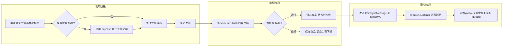
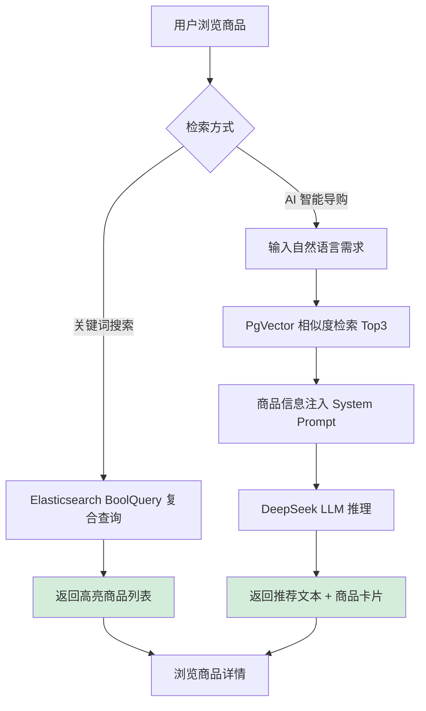
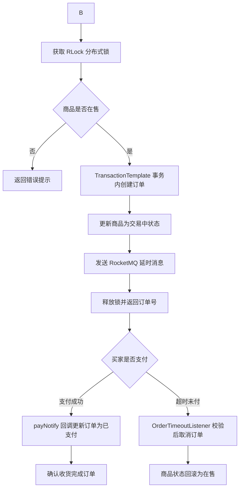
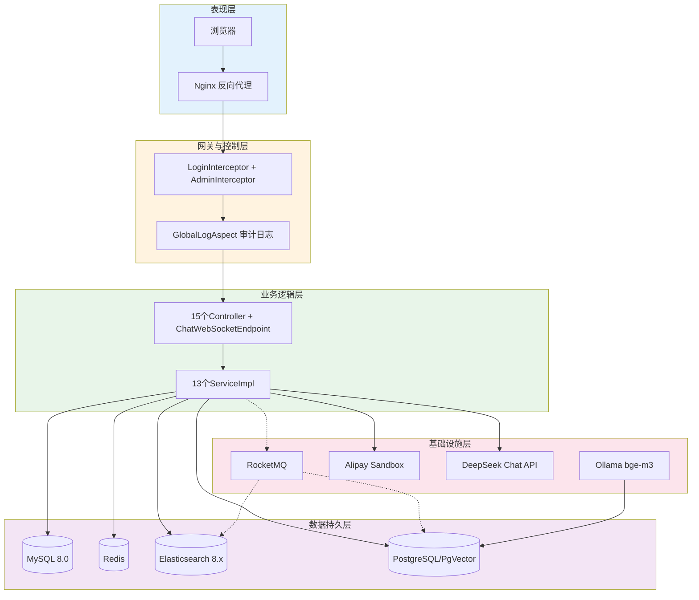
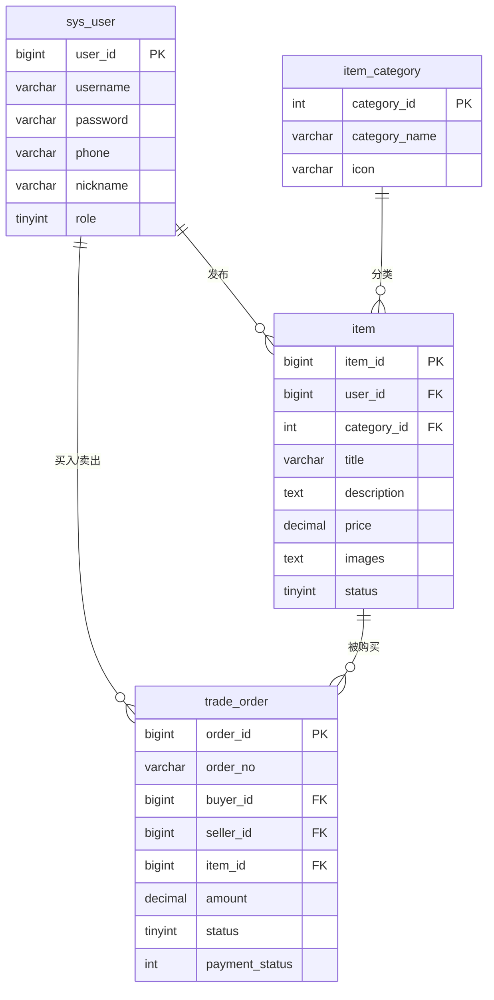
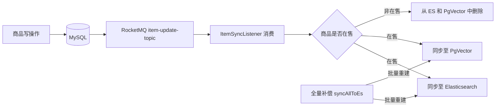
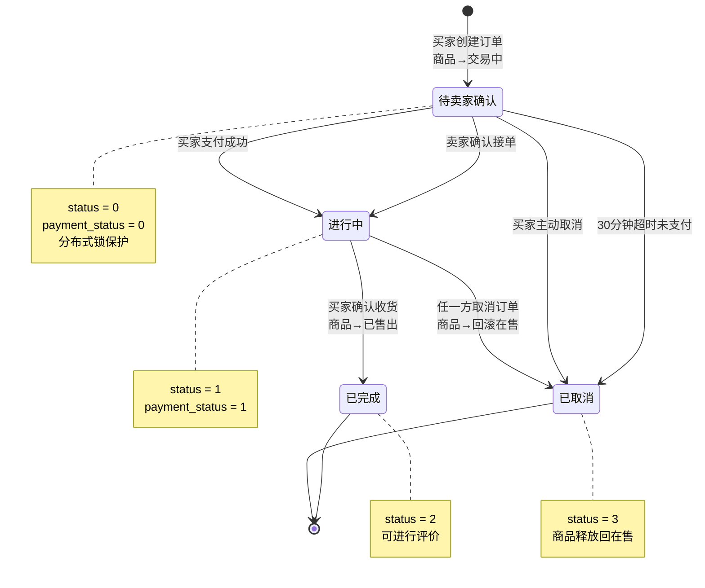
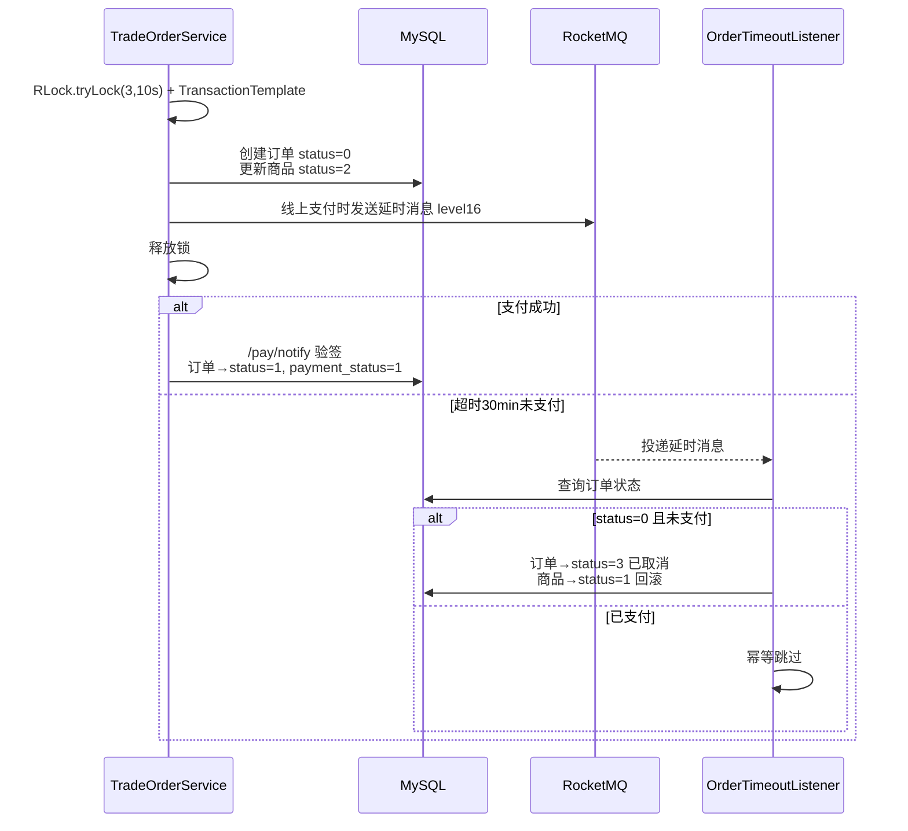
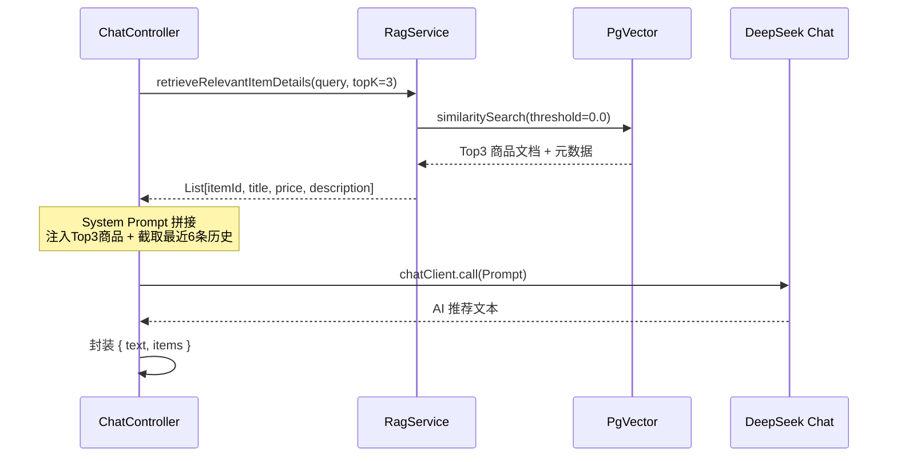

  **基于 Vue3+SpringBoot 的校园闲置物品循环利用系统设计与实现**

# **摘要**

 

高校闲置物品的周期性积压是一个长期存在但缺少有效技术方案的问题。每学期末，大量教材、电子产品和生活用品在短暂使用后即被闲置，而传统综合类二手平台在校园这一封闭场景中始终未能提供精准的撮合机制——搜索精度不够、发布门槛偏高、沟通工具缺乏场景定制。本文设计并实现了一款面向校园的智能化二手交易平台 SwapU，从系统工程和 AI 应用两个维度回应上述挑战。

平台采用前后端分离架构：前端以 Vue 3 配合 Element Plus 构建响应式界面，后端基于 Spring Boot 3.2 提供 RESTful API，数据层由 MySQL 8.0 承担事务存储、Redis 负责缓存加速。业务层面，平台打通了从商品发布、订单流转到支付宝沙箱支付的全链路交易闭环，并以 WebSocket 协议支撑买卖双方的实时通讯。

AI 侧的整合是 SwapU 区别于一般交易系统的核心。架构上，Spring AI 框架统一了 LLM 调用入口，Elasticsearch 接管了全文检索。在导购环节，平台用 RAG（检索增强生成）技术搭配 PgVector 向量数据库，构建了一个具备上下文理解能力的智能导购助手——用户以自然语言提问，系统先检索真实库存再交由模型生成推荐，从而抑制了通用大模型在垂直场景中常见的"幻觉"问题。在发布环节，大语言模型（DeepSeek/Ollama）的一键文案润色功能让卖家只需输入关键信息即可获得结构化的商品描述。

测试数据表明，SwapU 在 500 线程持续施压 5 分钟的条件下，核心交易链路没有出现状态断点或脏数据。RocketMQ 延时队列保障了订单超时场景下的状态一致性与库存回滚。整体系统将多组件协同架构与 AI 技术融合为一个完整可用的工程方案，为大型语言模型在垂直电商领域的落地提供了实证参考。

 

***\*关键词\**** ：校园二手交易；Spring Boot；Vue 3；大语言模型；RAG；RocketMQ

 

# **Abstract**

 

The cyclical accumulation of idle items on university campuses is a persistent structural problem. At the end of every semester, textbooks, electronics, and household goods—barely used—are discarded, yet general-purpose second-hand platforms remain ill-fitted for the campus context: search results lack geographic precision, listing creation demands too much effort, and communication tools lack scenario-specific design. This paper presents SwapU, a campus-oriented intelligent second-hand trading platform that addresses these gaps through a combination of system engineering and practical AI integration.

The platform adopts a decoupled frontend-backend architecture: Vue 3 with Element Plus on the frontend, Spring Boot 3.2 RESTful APIs on the backend, MySQL 8.0 for transactional storage, and Redis for caching. The core trading loop—item publishing, order processing, and Alipay Sandbox payment—is fully implemented, with WebSocket-based real-time messaging connecting buyers and sellers.

The AI layer is where SwapU departs from conventional second-hand systems. The Spring AI framework provides a unified abstraction over LLM providers, while Elasticsearch handles full-text search. On the search side, RAG (Retrieval-Augmented Generation) technology combined with the PgVector vector database powers an intelligent shopping assistant: user queries in natural language are first matched against real inventory via vector similarity search, and only then passed to the LLM for grounded recommendation—a design that directly suppresses hallucination. On the listing side, a one-click copywriting polish feature powered by LLMs (DeepSeek/Ollama) generates structured product descriptions from minimal keyword input.

Load testing at 500 concurrent threads for 5 minutes confirmed zero broken state transitions and zero dirty data across core trading APIs. RocketMQ delayed messages ensure consistent order timeout handling and inventory rollback. The system demonstrates that practical AI deployment in a vertical e-commerce domain is achievable through careful data pipeline engineering rather than model selection alone.

 

Keywords : Campus Second-hand Trading; Spring Boot; Vue 3; Large Language Model; RAG; RocketMQ

 

目录

[摘要	](#_Toc5982 )

[Abstract	](#_Toc923 )

[第1章 绪论	](#_Toc4423 )

[1.1 课题研究背景及意义	](#_Toc12942 )

[1.2 国内外研究现状	](#_Toc27526 )

[第2章 相关技术与开发环境	](#_Toc14115 )

[2.1 前端核心技术栈	](#_Toc18927 )

[2.2 后端核心技术框架	](#_Toc25877 )

[2.3 数据库与分布式中间件技术	](#_Toc15287 )

[2.4 人工智能与大模型技术集成	](#_Toc6016 )

[第3章 系统需求分析	](#_Toc7494 )

[3.1 可行性分析	](#_Toc22533 )

[3.2 业务流程分析	](#_Toc15681 )

[3.3 功能需求分析	](#_Toc8213 )

[第4章 系统总体设计	](#_Toc1841 )

[4.1 系统架构设计	](#_Toc3461 )

[4.2 功能模块设计	](#_Toc18495 )

[4.3 数据库与安全设计	](#_Toc27868 )

[第5章 系统详细设计与实现	](#_Toc1746 )

[5.1 基础模块与限流机制实现	](#_Toc20219 )

[5.2 核心业务流转与检索策略实现	](#_Toc27666 )

[5.3 AI 智能导购与文案生成底层实现	](#_Toc19721 )

[第6章 系统测试	](#_Toc30369 )

[6.1 测试环境与目的	](#_Toc29903 )

[6.3 性能与安全测试	](#_Toc10254 )

[6.4 测试结论	](#_Toc26858 )

[第7章 总结与展望	](#_Toc10943 )

[7.1 总结	](#_Toc23411 )

[7.2 问题与展望	](#_Toc7282 )

 

# **第1章 绪论**

## 1.1 课题研究背景及意义

高校闲置物品的周期性积压，并不是一个新现象。每学期末，宿舍楼下成摞的考研书、没拆封的生活用品、用了几个月的电子设备——这批物资被”淘汰”的原因并非丧失了使用价值，而是原主人的学业阶段发生了切换。一面是巨量闲置品的持续产生，另一面是新生群体年复一年的刚性采购需求。二者的错配是结构性的。因此，构建一个高效便捷的校园二手交易生态，在资源循环利用和绿色消费两个维度上都具有切实的现实意义。

一个值得追问的问题是：闲鱼和转转为什么没能有效覆盖这一需求？从体量上看，闲鱼背靠支付宝的信用体系，转转在 3C 品类的质检流程也做得扎实。但它们的架构基因是”全国大市场”——算法优先推荐跨区域优质卖家，物流体系围绕快递网络设计，商品池大到无法用校区半径圈定。这套逻辑放在校园场景里，出现了三方面的错位。其一，信息匹配效率不足。搜索者关心的不是全国范围内谁的信用分最高，而是对方是否在相邻宿舍楼。传统基于倒排索引的关键词匹配难以理解”便宜且适合考研用的”这类带有隐含意图的自然语言查询，召回率与准确率均不理想。其二，发布门槛偏高。撰写一条吸引人的商品描述需要一定的时间和表达力——大多数学生不愿投入太多精力，但过于简略的描述又难以在搜索中获得曝光。徐雅靖基于 SOR（刺激-机体-反应）理论模型，将二手交易 APP 的用户体验划分为视觉体验、内容体验、交互体验和安全体验四个维度，通过问卷调查与回归分析验证了各维度对交易信任的正向影响关系，其中内容体验维度——即商品信息的呈现质量——对消费者最终使用意愿的总效应最为显著[1]。换言之，帮助卖家产出高质量的商品描述，不仅是降低发布门槛的问题，更是直接影响平台交易转化率的关键环节。其三，沟通缺乏场景化考量。校园二手交易以当面交付为主，聊天中频繁涉及”什么时间在哪栋楼碰头”这类本地化信息，但现有综合平台的即时通讯功能在设计上并未对校园场景做针对性优化。王颖在社区二手物品处置系统的研究中也指出，本地化服务能力——包括地理半径匹配和即时沟通工具的适配程度——是影响二手平台在细分场景中用户活跃度的关键因素[2]。

SwapU 的设计正是围绕上述三个支点展开的。平台基于 Spring Boot 3.2 与 Vue 3 构建了完整的交易链路，更关键的是将 Spring AI 框架与大语言模型嵌入到了两个核心业务环节。在发布侧，卖家只需输入关键信息并点击”AI 一键润色”，系统通过反复调优的 System Prompt 调用大模型生成结构化的商品描述文案，显著降低了商品信息的呈现门槛。在导购侧，用户以自然语言在对话框中提问，系统并不直接将问题交给大模型，而是先在 PgVector 向量数据库中执行余弦相似度检索，将平台上真实在售的 Top 3 商品信息——包括标题、价格和描述——作为上下文注入 Prompt，再由模型基于这些真实数据生成推荐。这一”先检索，后生成”的 RAG（检索增强生成）架构，是 SwapU 在工程上最核心的设计决策：它从根本上抑制了大模型在垂直场景中常见的”幻觉”问题。本课题的产出，既是一个完整可运行的校园二手交易系统，也为大型语言模型在垂直电商领域的工程化落地提供了一份实证参考。

## 1.2 国内外研究现状

二手交易在商业形态上已形成了较为成熟的范式。国外方面，eBay 率先将分类信息数字化并构建了基于信誉评分的交易体系，Craigslist 以极简信息发布降低用户参与门槛，Poshmark 则融入了社交互动与直播元素以提升平台黏性。国内方面，闲鱼依托支付宝的芝麻信用体系构建了 C2C 交易信任机制，转转在手机等 3C 品类上凭借质检和官方验机服务实现了差异化定位。上述平台的共同范式是 C2C 或 C2B2C，运营策略面向泛品类、全国性市场。然而，泛品类策略在校园场景中存在明显的适用性边界。校园二手交易受三条约束影响：地理半径通常控制在单个校区或大学城范围内；商品品类高度集中于教材教辅、电子设备和日常生活用品；交易方式普遍偏好当面自提而非快递配送。现有综合平台的系统架构围绕”全国物流 + 海量 SKU + 信用评分”这一核心逻辑优化，当商圈缩小至校区尺度后，地理围栏、品类引导、校内即时沟通工具等需求均无法得到满足。庞媛媛以闲鱼为案例，从颠覆式创新理论视角分析了闲置交易平台的演进路径，研究指出垂直化与场景化是二手平台突破同质化竞争的关键方向，但同时也面临用户规模与运营成本之间的平衡难题[3]。在校园二手交易系统的技术实现层面，已有研究者进行了不同程度的探索，但现有工作大多停留在基础的信息发布与关键词检索层面，智能化程度偏低——搜索不提供语义理解能力，发布流程缺乏对卖家的辅助支持，系统架构也较少考虑高并发场景下的数据一致性问题。

从技术演进的角度看，二手电商平台的搜索能力经历过几个阶段的迭代。最早采用数据库 LIKE 模糊查询，小数据量下尚可应对，但无法胜任数据规模增长后的检索需求。随后，基于 Elasticsearch 的 BM25 算法配合协同过滤技术显著提升了关键词匹配的精度和召回率，但对于”便宜的考研数学资料”这类口语化、带有隐含意图的查询，语义理解层面仍存在明显短板。大语言模型的突破为这一困境提供了新的技术路径，但直接将通用大模型用于生产级电商导购系统面临一个关键障碍——“幻觉”问题：模型可能自信地推荐平台上根本不存在的商品，且响应文本的语气笃定程度使用户难以察觉错误。这正是 RAG 架构所要解决的核心问题。

RAG 的核心思想是”先检索，后生成”：在将用户查询交给大模型之前，先从外部知识库中检索出最相关的真实数据，再将这些数据作为参考上下文注入 Prompt，使模型的回答被约束在真实数据范围内。王祎以上海市革命烈士档案为例，构建了一套结合知识库与 Neo4j 知识图谱的 RAG 问答系统——通过 BERT 模型和 Chroma 向量数据库创建烈士信息向量库，同时利用知识图谱存储人物关系网络，在问答环节通过相似度检索与图谱推理的双重约束来确保模型输出的事实准确性[4]。该方案在知识服务领域的成功验证了”向量检索 + 结构化知识”双通道增强策略的有效性。杨梓鹏针对跨境电商智能客服场景，提出了自适应检索增强生成（Adaptive-RAG）和任务感知检索增强生成（Task-aware RAG）两种优化方法：前者通过动态调整检索策略适应不同复杂度的查询，后者通过任务分解将复杂查询拆为多个子任务分别检索再整合。实验表明，两种方法的组合策略在 85% 的测试场景中优于单独使用其一，其用户意图分类模型（基于 CNN-BiLSTM 的多特征融合方案）在跨境客服数据集上达到了 0.921 的准确率[5]。该研究为 RAG 在电商垂直场景中的工程适配提供了有价值的实践参考。

然而，从学术验证到生产级部署，RAG 系统面临着一系列工程层面的挑战。商品库处于持续变动之中——上新、下架、改价、成交——如何保证向量数据库中的 Embedding 与关系型数据库中的行记录保持同步？消息丢失时如何处理？Embedding API 调用超时时应如何降级？这些问题在学术论文中通常不展开讨论，但在实际部署中每一个都可能导致系统向用户输出错误推荐。本课题的 SwapU 系统将注意力集中在了这些工程细节上：采用 RocketMQ 作为异步消息中间件实现增量同步的削峰填谷，通过全量同步机制作为数据兜底方案，并在消息消费者中实施状态过滤——仅同步在售商品、删除已下架商品的向量记录。在校园二手交易这一细分方向上，上述工程实践的完整度在现有研究中较为少见。

 

# **第2章 相关技术与开发环境**

技术选型上有一条原则贯穿始终：每个组件都应有其不可替代的存在理由。Vue 3 不是因为版本新才采用，而是 Composition API 在处理商品发布页那种七八个状态变量相互影响的复杂组件时，将关联逻辑聚合在一起的写法确实比 Options API 更易于维护。Spring Boot 3.2 不是因为主流才使用，而是 MyBatis-Plus 的条件构造器使动态 SQL 几乎无需手写。以下按前端、后端、中间件、AI 四个板块展开。

## 2.1 前端核心技术栈

前端的底层框架选用了 Vue 3。严格来说 React 也能胜任，但在 SwapU 这类强交互型应用里——聊天窗口的 WebSocket 连接状态管理、发布页面的多图片上传与 AI 文案回显——Vue 3 的响应式系统和组合式 API 在开发效率上的优势更为明显。构建工具选择了 Vite 而非 Webpack：冷启动时间从半分钟级降至秒级，热更新（HMR）几乎瞬时完成。这一差异对实际开发节奏的影响显著——Vite 基于浏览器原生 ES Module 的按需编译机制，避免了 Webpack 在开发模式下对全量模块的预打包开销。

Element Plus 承担了 UI 层的全部工作。选择它的考虑较为务实：自研组件库需要大量精力，而 Element Plus 提供的表单校验、表格分页、弹窗对话框等组件恰好覆盖了 SwapU 前端约 80% 的交互场景。Pinia 替代 Vuex 管理全局状态：登录凭证存储在一个 store，未读通知计数、聊天未读数各用独立的 store 管理。相较于 Vuex，Pinia 去掉了 Mutations 中间层，其 setup 式写法减少了模板代码量，且对 TypeScript 的类型推断更为友好。

Axios 进行了二次封装。请求拦截器从 localStorage 中取出 token 并写入请求头的 Authorization 字段；响应拦截器检查返回的 code 字段——若为 401 则清除本地缓存并跳转至登录页。该逻辑集中在单一模块中，所有页面的 API 调用均自动获得鉴权和异常处理能力。timeout 设置为 60000 毫秒而非默认的 10000 毫秒，原因是 AI 导购接口的同步调用在极端情况下可能需要等待十余秒。

## 2.2 后端核心技术框架

后端基座为 Spring Boot 3.2，运行在 JDK 17 上。Spring Boot 的自动装配和 starter 生态大幅降低了 Java Web 开发的启动成本。在此基础上，本系统重点利用了两个间接性的 Spring 特性：AOP 和 IoC。

GlobalLogAspect 切面是后端代码中投入产出比最高的设计之一。该切面使用 @Around 注解包裹了 com.swapu.controller 包下所有 public 方法：请求进入时记录 URL、HTTP 方法、类名、方法名及入参，响应返回时记录执行耗时和结果摘要。结果长度超过 500 字符则进行截断以避免日志膨胀。开发该切面仅需约半小时，但在后续联调支付宝支付回调、定位 RocketMQ 消息丢失、排查 Elasticsearch 同步延迟等问题时，其提供的全量审计日志节省了可观的排查时间。

持久层采用 MyBatis-Plus 3.5.5。其内置的通用 Mapper 和条件构造器在复杂筛选场景下优势明显——例如商品筛选接口需要同时组合关键词、分类 ID、价格区间、成色等级和排序字段五个维度。若使用传统 XML 方式编写动态 SQL，对应的 <where> 标签将嵌套多个 <if> 判断；使用 QueryWrapper 则只需一行链式调用即可完成。但在 N+1 查询问题上，MyBatis-Plus 的自动关联映射存在性能隐患。以订单列表接口为例——每条订单需加载买家昵称、卖家昵称和商品标题缩略图，若每条记录分别查询一次用户表和商品表，200 条订单将产生 400 余次额外查询。本系统的处理方式是在 Service 层手动调用 selectBatchIds 进行批量预取：将所有订单关联的 itemId 收集至 Set 中，一次性批量查询出全部 Item 记录，同理批量查询出所有 User 记录，然后将结果存入 HashMap，由各订单记录按 ID 进行内存级匹配。经此优化后，200 条订单的查询次数从 600 余次降至 3 次。

数据安全方面，User 实体中的 phone 字段不能以明文形式存储。但若在每个接口中手动调用加解密方法，代码将出现大量重复逻辑且容易遗漏。本系统利用 MyBatis-Plus 的 TypeHandler 机制编写了 AesEncryptTypeHandler：标注了 @TableField(typeHandler = AesEncryptTypeHandler.class) 的字段，在执行 INSERT 或 UPDATE 时自动调用 AES-128/ECB/PKCS5Padding 算法加密后写入数据库，执行 SELECT 时自动解密还原为 Java 对象。Service 层和 Controller 层对加密过程完全无感知。使用数据库客户端直接查询 user 表时，phone 字段为密文；通过接口返回的 JSON 响应中，手机号则为正常可读的明文。

## 2.3 数据库与分布式中间件技术

MySQL 8.0 是 SwapU 中承担事务性存储的核心——用户认证信息、商品快照、订单流水等数据的写入操作必须支持事务并满足 ACID 特性。trade_order 表在 buyer_id 和 seller_id 字段上分别建立了 B+ 树索引，item 表在 user_id 和 category_id 字段上也建立了索引，覆盖了 80% 以上的查询场景。

Redis 在系统中承担了三项职责。第一项是缓存——ItemServiceImpl 类上配置了 @CacheConfig(cacheNames = "item")，写操作方法（publish、updateItem、deleteItem、updateStatus 等）均标注 @CacheEvict(allEntries = true) 以在数据变更时清除缓存。读操作方面，原 @Cacheable 注解因浏览量（view_count）字段需要每次查询实时更新而被注释停用，当前读缓存依赖 Elasticsearch 的倒排索引性能进行补偿。第二项是分布式锁——这是保证数据正确性的硬性要求。下单操作若不锁定 item:lock:{itemId}，两个并发请求可能同时读取到 status=1（在售状态），并各自认为可以执行购买，导致库存数据损坏。Redisson 的 RLock.tryLock(3, 10, TimeUnit.SECONDS) 提供了带等待超时（3 秒）和自动释放（10 秒）的加锁语义，且其内置的看门狗（Watchdog）机制会在锁持有期间自动续期——避免业务执行时间超出锁的过期时限。手写 setnx + expire 的组合无法提供同等级别的可靠性保障。第三项是令牌桶限流，部署在订单创建接口上，用于控制并发写入速率。

RocketMQ 管理两个 Topic。item-update-topic 负责在商品发布、修改或状态变更后，将 ItemSyncMessage 异步推送至 ItemSyncListener，由消费者完成 Elasticsearch 索引和 PgVector 向量的增量同步。order-timeout-topic 专门处理下单后超时未支付的场景。这里存在一个方案比选：为什么不使用定时任务轮询？传统的 Spring Task 每隔数分钟扫描 trade_order 表，查找超过 30 分钟且 status=0 的记录进行批量取消。该方案存在两个弊端——扫描间隔过短会导致大部分扫描周期内无有效数据，造成数据库连接空转浪费；扫描间隔过长则订单可能在超时后较久才被取消，时效性不足。RocketMQ 的延时消息机制避免了两方面的问题：发送消息时指定延迟级别（对应 30 分钟），不产生轮询开销，消息在预设时间精确投递至消费者执行取消逻辑。

Elasticsearch 8.x 的职责定位清晰：MySQL 负责写操作与事务性存储，ES 负责搜索读操作。采用 MySQL 的 LIKE 语句进行模糊搜索存在明显的性能瓶颈——SELECT * FROM item WHERE title LIKE '%考研%' OR description LIKE '%考研%' 无法利用索引，执行全表扫描，在 200 条测试数据下耗时数十毫秒，数据量增至千条级别后性能进一步恶化。ES 的倒排索引在同等数据体量下检索耗时仅为个位数毫秒。此外，ES 的 match_phrase_prefix 查询支持用户在输入过程中即获得前缀匹配提示，wildcard 查询可容忍错别字和非标准缩写——这两项能力均超出了 MySQL LIKE 的功能边界。

## 2.4 人工智能与大模型技术集成

AI 层面的技术选型遵循一个核心前提：后端不应与某一家大模型厂商强绑定。当 DeepSeek 调整定价或服务出现波动时，系统需能够切换至其他供应商或本地部署的 Ollama 模型，且切换不能引发业务代码的大规模修改。Spring AI 的 ChatClient 接口和 VectorStore 抽象层解决了这一需求——业务代码面向接口编程，底层实现通过修改 application.yml 中的配置项进行切换。开发环境中，对话模型通过 DeepSeek 的 OpenAI 兼容端点接入（base-url 配置为 https://api.deepseek.com），Embedding 模型则使用本地 Ollama 部署的 bge-m3:latest。

RAG 管线在工程层面由三个物理组件构成。PgVector——PostgreSQL 的向量扩展插件——负责存储商品文本的 Embedding 向量。其中索引类型选用 HNSW（分层可导航小世界图），距离度量采用余弦距离（COSINE_DISTANCE），向量维度为 bge-m3 模型输出的 1024 维。Ollama 在每次商品发布或内容更新时，将”商品名称 + 商品描述”的拼接文本通过 bge-m3 模型转换为浮点向量并写入 PgVector。王祎在档案领域的 RAG 研究中同样采用了向量数据库（Chroma）与结构化知识存储（Neo4j）相结合的双通道架构[4]，与本系统将 PgVector 与 MySQL 搭配使用的思路具有共同的技术逻辑——向量检索负责语义匹配，关系型数据负责完整的信息查询。杨梓鹏的研究则进一步揭示了检索策略的配置对 RAG 系统性能的显著影响，其自适应检索策略（Adaptive-RAG）的实验结果说明，根据查询复杂度动态调整检索参数是提升系统响应质量的关键手段[5]。本系统在导购环节的核心设计——先检索 Top 3 商品再注入 Prompt——本质上也是检索结果与生成质量之间平衡的一种工程化选择。

DeepSeek Chat 在用户发起导购对话时，基于系统注入的检索结果进行引导式推荐。这条链路中最容易被忽视的环节不是模型选型本身，而是 System Prompt 的调优。文案润色功能经历了十余个版本的迭代。最初仅告知模型”帮用户润色商品描述”，输出经常以”好的，以下是润色后的描述……”开头，篇幅动辄超过千字，偶尔还会擅改用户输入中的关键信息（如将”红轴键盘”改为”青轴键盘”）。后续在 Prompt 中加入三项硬约束——角色定位为专业二手文案编辑、输出内容仅包含纯文案不含开场白或结尾语、字数上限 500 字——版本迭代后输出才从”偶尔可用”转变为”基本可靠”。

智能导购功能的 Prompt 更为复杂。除了角色定位和输出格式的约束外，必须注入”严禁编造不存在的商品”这一强制指令，以及从 PgVector 中实时检索出的 Top 3 商品元数据。该元数据——包含标题、价格、描述——是 RAG 管线的核心产出，也是将模型输出约束在真实库存范围内的信息锚点。

 

# **第3章 系统需求分析**

需求分析的核心价值在于明确三个问题：系统的边界在哪里、用户的核心路径如何走、哪些非功能性指标不可妥协。SwapU 的目标用户画像明确——在校大学生，地理活动半径通常不超过单个校区范围，交易品类集中于教材教辅和电子产品——这些约束直接决定了功能设计的取舍方向。

## 3.1 可行性分析

技术层面的评估基于现有开源生态的成熟度。全栈的每一个关键组件——前端 Vue 3、后端 Spring Boot 3.2、MySQL 8.0、Redis、RocketMQ、Elasticsearch、PgVector——均基于社区活跃的开源方案，不存在底层技术不可行的风险。需要单独验证的是 RAG 管线的稳定性：Spring AI 0.8.1 对 ChatClient 和 VectorStore 的封装在 Chat 和 Embedding 两条核心路径上是否足够可靠，以及 PgVector 在商品频繁更新场景下的检索延迟是否在可接受范围内。第一轮端到端原型在 1000 条测试商品数据下完成验证：PgVector 的 HNSW 索引在千条以下向量规模上的相似度检索延迟为毫秒级，远低于 LLM 推理本身所需的 2 至 3 秒；Spring AI 的 API 虽为 milestone 版本，但在 Chat 和 Embedding 两条本系统依赖的核心路径上表现稳定。

经济可行性的评估较为直接。开发工具方面，IDE 社区版及所有框架、中间件均为开源且免费使用。部署方面，各中间件服务（MySQL、Redis、RocketMQ、Elasticsearch、PostgreSQL/PgVector）及 Ollama 部署在一台 4 核 8 GB 的云主机上，后端 Spring Boot 应用与前端 Vite 开发服务器分别运行，月租成本可控。唯一的持续性开销为 DeepSeek API 调用费用，其定价相对低廉（百万 token 级别为数元人民币），且系统在 application.yml 中预留了切换路径——修改 spring.ai.openai.base-url 配置项即可将对话模型切换至本地 Ollama 部署，API 成本可降至零。

操作可行性方面，目标用户群体（在校大学生）对电商类应用和即时通讯工具的交互模式已高度熟悉。Element Plus 的卡片式信息流、底部导航栏、聊天界面等组件与主流移动应用的交互语言一致，用户无需额外的学习成本即可完成基本操作。

## 3.2 业务流程分析

SwapU 的业务核心可归纳为三条主线，三者之间存在清晰的顺序依赖：商品发布生成可检索的库存，检索与导购匹配产生订单，订单流转过程中沟通贯穿始终。

 

在商品发布流程中，卖家登录后进入发布页面，上传商品实物图片并选择分类。为降低文案撰写门槛，卖家可在输入框中填入简要关键词后点击”AI 一键润色”按钮，前端将请求发送至 /ai/polish 接口，后端调用 DeepSeek Chat 生成结构化的 Markdown 文案并回显至页面。发布操作不仅是向数据库写入一条记录：代码中 ItemServiceImpl.publish 方法在保存商品后，首先调用 DeepSeekUtils.checkItemPublish 方法——通过独立的 System Prompt 对标题和描述进行合规性检查，若 AI 返回审核不通过则将商品状态标记为 status=4（已下架）直接拒绝上架；审核通过后，保存商品（status=1 在售），随后执行两条并行的同步路径：路径一，通过 CompletableFuture.runAsync 异步调用 ragService.addDocument(item) 直接将商品信息的 Embedding 写入 PgVector 向量库；路径二，通过 syncToEs 方法构建 ItemSyncMessage 投递至 RocketMQ 的 item-update-topic。ItemSyncListener 消费该消息后，调用 ItemServiceImpl.doSyncToEs 方法，在该方法内向 Elasticsearch 写入索引（itemRepository.save），同时再次以 CompletableFuture 异步向 PgVector 写入 Embedding。两条路径在 PgVector 写入上存在冗余，但各自独立执行，保证了在 MQ 延迟或单点故障场景下向量数据仍能被及时同步。商品发布业务流程如图 3-1 所示。

<b>图 3-1 商品发布业务流程图</b>

 

在检索与导购流程中，买家获取商品有两条路径。路径一为关键词检索：用户在搜索框输入查询词，Elasticsearch 执行基于 BoolQuery 的复合查询，组合 match_phrase_prefix、wildcard 与 Term/Range 过滤条件，返回高亮标注的商品列表。路径二为 AI 智能导购：用户在导购界面以自然语言描述需求（如”两百以内有没有适合工科生用的二手计算器”），系统触发 RAG 管线——向量检索 → 上下文拼接 → LLM 推理——最终返回携带有商品卡片数据与推荐文本的结构化回复。这两条路径不是互斥的，用户可以在搜索结果不满意时随时切到 AI 助手，反之亦然。检索与导购业务流程如图 3-2 所示。

<b>图 3-2 检索与导购业务流程图</b>

 

在订单交易流程中，买卖双方通过 WebSocket 通道（/ws/chat/{userId}）就商品细节进行沟通。买家确认购买后点击”立即购买”，系统调用 TradeOrderController.createOrder 接口。该接口首先获取以 “order:rate:” + userId 为键的 Redisson RRateLimiter 令牌桶进行限流（单用户每分钟 3 次），随后调用 TradeOrderServiceImpl.createOrder 方法。createOrder 方法首先获取以 “item:lock:” + itemId 为键的 Redisson RLock 分布式锁（tryLock 等待 3 秒，持有 10 秒），在校验物品状态为在售后生成订单、将商品标记为 status=2（交易中），若支付方式为线上支付（paymentMethod=1），则向 RocketMQ 的 order-timeout-topic 投递一条延时级别为 16（对应 30 分钟）的 OrderTimeoutMessage；线下交易（paymentMethod=2）不触发超时机制。买家随后被引导至支付宝沙箱完成支付。若在超时窗口内完成支付，支付宝通过 /pay/notify 异步回调通知后端，验签通过后更新订单状态为 status=1（进行中）并标记支付状态为已支付；若超时未付，OrderTimeoutListener 消费延时消息，在确认订单仍为 status=0（待确认）且支付状态为未支付后，执行订单取消（status=3）与商品状态回滚（恢复为 status=1 在售）。订单交易业务流程如图 3-3 所示。

<b>图 3-3 订单交易业务流程图</b>

## 3.3 功能需求分析

本系统的用户角色通过 User 实体中的 role 字段区分，分为两类：普通用户（role=0，对应买卖双方）和系统管理员（role=1）。未登录用户通过 LoginInterceptor 的白名单机制（放行 login、register、item/list、item/detail 等路径）可浏览部分公开内容，但不构成独立的用户角色。基于对上述三条业务流程的梳理，系统功能划分为前台交易子系统与后台管理子系统。

前台交易子系统的核心功能模块如下：

（1）用户认证与个人中心模块。提供基于 BCrypt 加密的注册与登录功能，登录成功后签发 JWT Token（io.jsonwebtoken 0.12.5）。个人中心支持查看已发布商品（按状态分类）、收藏商品列表、买入/卖出订单的查询与管理。商品状态变更（下架、重新上架等）的前端操作仅为触发按钮，后端逻辑在 Controller 层通过 LoginInterceptor 注入的 userId 与资源归属进行比对校验，确保只有商品发布者本人才能执行状态修改。

（2）商品浏览与检索模块。首页以卡片式信息流展示在售商品，顶部按分类层级提供导航。检索功能基于 Elasticsearch 的 BoolQuery 复合查询，组合 match_phrase_prefix、wildcard 与 Term/Range 过滤条件，覆盖标题与描述的模糊匹配。排序维度包括价格升降序、发布时间及热度（want_count 字段）。搜索框的交互位置与搜索结果页的信息结构直接影响用户的检索频率和浏览转化率。

（3）AI 智能交互模块。包含发布阶段的”一键文案润色”（/ai/polish 接口）和独立的”AI 智能导购”对话界面（/ai/chat 接口）。导购助手支持多轮对话上下文记忆，ChatController.chat 方法在构建 Prompt 时截取最近 6 条历史消息（history.size() - 6），并能依据用户的模糊购物意图通过 RagService.retrieveRelevantItemDetails 方法（Top 3 相似度检索）准确召回匹配商品。

（4）即时通讯与留言模块。基于 WebSocket 长连接实现买卖双方点对点实时文本沟通，端点路径为 /ws/chat/{userId}，通过 URL 查询参数中的 token 进行 JWT 鉴权。在线用户由 ChatWebSocketEndpoint 的 ConcurrentHashMap 管理，聊天记录通过 ChatMessageMapper 持久化至 MySQL 以支持离线消息拉取和历史查询。商品详情页设置公开留言板，支持其他用户就商品内容进行提问与卖家回复。

（5）订单与支付流转模块。覆盖下单、支付拉起、状态查询、交易取消与确认收货的完整链路。下单接口（TradeOrderController.createOrder）在 Controller 层以 Redisson RRateLimiter 实施令牌桶限流（3 次/分钟/用户），在 Service 层以 RLock 分布式锁保证库存扣减的原子性。订单状态流转在服务端通过分布式锁与数据库事务双重保障严格控制。

后台管理子系统的核心功能侧重于数据监控与平台治理：

（1）数据大盘模块。以 ECharts 图表展示平台关键运营指标——近 7 日订单量趋势、新增用户数、商品品类分布以及大模型接口调用频次（用于监控 API 费用消耗）。

（2）内容审核模块。管理员可对全平台商品、留言及用户举报进行统一管理，支持对违规商品执行强制下架操作。举报处理结果联动更新被举报对象的状态字段，确保审核操作形成闭环。

（3）向量知识库同步模块。日常商品变更通过 RocketMQ 的 item-update-topic 消息驱动增量同步（ItemSyncListener 消费后调用 doSyncToEs 方法分别写入 Elasticsearch 和 PgVector），批量数据修复或重建场景下可通过全量同步方法（syncAllToEs）重建 Elasticsearch 与 PgVector 索引，保障 RAG 系统的数据时效性。

## 3.4 非功能需求分析

非功能性需求中，以下几个方面在本系统中具有刚性约束：

第一，接口性能。首页商品列表和详情页是流量最大的两个入口——在开学季和毕业季的峰值时段，平均响应时间需控制在 200 毫秒以内。下单接口因涉及分布式锁（Redisson RLock.tryLock）和数据库事务，可放宽至 500 毫秒。AI 接口受制于外部 API 的响应速度，无法硬性保证延迟，但在应用层通过 RestClientConfig 设置了 60 秒连接超时和 120 秒读取超时，并需要相应的降级策略。限流措施实施在下单接口：TradeOrderController.createOrder 中以 Redisson RRateLimiter 实现（RateType.OVERALL 模式，单用户每分钟 3 次，限流键为 "order:rate:" + userId）。登录接口当前未配置限流，在后续版本中需补充。

第二，数据安全。用户手机号采用 AES-128/ECB/PKCS5Padding 算法加密存储，通过 MyBatis-Plus TypeHandler 在数据层透明加解密（详见第 2 章 AesEncryptTypeHandler 实现），不以明文形式写入数据库。所有涉及资源归属的操作——修改商品信息、取消订单、查看私密聊天记录——均在服务端执行 userId 比对校验。校验分为两个层次：LoginInterceptor 在拦截器层负责身份鉴权（验证 JWT Token 的合法性），Service 层负责资源授权（比对操作对象的 owner 是否为当前用户），两者不可相互替代。

第三，系统可维护性。AI 模块与业务模块之间通过接口约定进行解耦。RagService 接口暴露 addDocument、retrieveRelevantItems 和 retrieveRelevantItemDetails 三个方法，底层使用的对话模型（DeepSeek 或 Ollama）以及向量库的具体选型（PgVector 或后续可能切换的方案），对上层 ChatController 而言是透明的。日志方面，GlobalLogAspect 切面（@Around 包裹 com.swapu.controller 包下所有 public 方法）记录所有 Controller 方法的调用参数和执行时间。SLF4J 按级别分流输出：info 记录关键业务节点（订单创建、支付回调、MQ 消息收发），debug 记录 AI 接口的完整 Prompt 和响应内容，error 记录所有未被捕获的异常及堆栈。

系统核心非功能性指标汇总如下：

| 指标项 | 目标值 | 适用接口/范围 |
|--------|--------|---------------|
| 商品列表查询响应时间 | ≤ 200ms | GET /item/list |
| 商品详情查询响应时间 | ≤ 200ms | GET /item/detail/{id} |
| 订单创建响应时间 | ≤ 500ms | POST /order/create |
| AI 对话接口超时上限 | ≤ 60s | POST /ai/chat |
| AI 文案润色超时上限 | ≤ 120s | POST /ai/polish |
| 单用户下单频率限制 | ≤ 3 次/分钟 | order:rate:{userId} |
| 分布式锁等待/持有时间 | 3s / 10s | item:lock:{itemId} |

# **第4章 系统总体设计**

需求分析定了"要做什么"，这一章解决的是"骨架怎么搭"。重点放在三件事上：五层架构的边界是怎么划的、四个模块的职责是怎么切的、以及 RAG 系统里那个最棘手的数据一致性问题是怎么用双轨同步解决的。

## 4.1 系统架构设计

SwapU 采用前后端分离的 B/S 架构。系统的运行时结构可拆分为五层，每一层的职责边界清晰、互不重叠。系统整体架构如图 4-1 所示。

<b>图 4-1 系统分层架构图</b>

表现层由 Vite 构建的静态产物经 Nginx 进行反向代理：/api 前缀的动态请求转发至后端 8080 端口，其余静态资源由 Nginx 直接返回。前后端逻辑从部署层面完全解耦。

第二层是网关控制层，负责在请求进入业务代码之前完成鉴权与审计。DispatcherServlet 分发请求前先经过 LoginInterceptor——从 Authorization 请求头获取 token，调用 JwtUtils.validateToken() 解析 Claims 中的 userId、username、role，写入 request.setAttribute()。若 token 为空或解析失败，直接向 HttpServletResponse 写入 code=401 的 JSON 响应并返回 false。通过拦截器的请求，userId 必定已在 request attribute 中。AdminInterceptor 仅拦截 /admin/** 路径，在前者基础上追加 role == 1 的整数比对校验。GlobalLogAspect 切面以 @Around 注解包裹所有 Controller 方法，记录 URL、入参、执行耗时和结果摘要，代码改动量小但排查价值大。

第三层是业务逻辑层，包含 15 个 Controller 类（另加 1 个 WebSocket 端点 ChatWebSocketEndpoint）和 13 个 ServiceImpl 实现类，两者基本一一对应。其中依赖最密集的是 ItemServiceImpl——除 CRUD 外，它承担向 Elasticsearch 和 PgVector 同步数据的中转职责，其 @Autowired 依赖注入列表包含 8 个外部对象：ItemMapper（MyBatis-Plus 数据访问）、ItemWantMapper（收藏记录）、ItemRepository（Spring Data Elasticsearch Repository）、ElasticsearchOperations（ES 底层操作）、RocketMQTemplate（消息投递）、SearchHistoryService（搜索历史）、DeepSeekUtils（AI 审核）和 RagService（向量库同步）。

第四层是数据持久层，各存储引擎之间有明确的职责隔离。MySQL 8.0 承担一切需要 ACID 保证的写入操作和关联查询。Redis 作为内存级热数据缓冲和分布式协调器，承载缓存（@CacheConfig + @CacheEvict 缓存清除机制）、分布式锁（Redisson RLock）和令牌桶限流（Redisson RRateLimiter）三项职责。Elasticsearch 8.x 是只读的搜索副本——其数据来源为 RocketMQ 消息驱动的增量同步，不产生原始数据。PgVector 是专供 RAG 管线使用的向量存储，配置 HNSW 索引、余弦距离度量和 1024 维向量（与 bge-m3 Embedding 输出维度对齐）。

最底层是基础设施层，包含四个外部系统。RocketMQ 维护两个 Topic：item-update-topic（ItemSyncMessage 的 type 字段为 1 时表示同步/更新，为 2 时表示删除）和 order-timeout-topic（延时级别 16，即 30 分钟）。支付宝沙箱提供当面付的支付闭环。DeepSeek Chat 通过 OpenAI 兼容接口处理 LLM 推理任务，Ollama 加载 bge-m3 模型处理文本 Embedding。

## 4.2 功能模块设计

系统在逻辑上切成了四块，彼此之间通过接口通信，不跨模块直接访问对方的数据库表。

基础支撑模块管的是所有业务共同依赖的横切逻辑。密码用 BCrypt 哈希，登录验证时把明文和数据库里的 $2a$10$ 开头的哈希值丢进 PasswordEncoder.matches()。JWT 签发逻辑封装在 JwtUtils 里，密钥和过期时间从 application.yml 注入——代码本身不硬编码任何密钥。文件上传至本地目录（file.upload-path 配置为 D:/SwapU/uploads/），通过 WebConfig 中映射的 /files/** 路径对外提供静态资源访问。全局异常处理和 Validation 参数校验也属于这个模块——任何 Controller 抛出的异常都会被 GlobalExceptionHandler 捕获，包成 Result error JSON 格式返回，前端统一处理。

核心交易模块的代码量最大。商品子模块维护了一个五态状态机（Item 实体中 status 字段的注释定义）：status=0 待审核（AI 审核完成前的临时状态）、status=1 在售、status=2 交易中、status=3 已售出、status=4 已下架（含违规强制下架）。状态只能由后端在特定业务节点（publish 中的 AI 审核通过、订单创建、支付成功、取消、管理员操作）主动修改，前端仅触发请求，Controller 层做 userId 权限校验。检索子模块将 ES 的 DSL 组装封装在 ItemServiceImpl 的 search() 和 suggest() 两个方法中，外部 Controller 只传入 keyword、categoryId、page、size 四个参数。订单子模块是事务最密集的部分——一次 createOrder 调用涉及获取 Redisson RLock 分布式锁、校验物品状态、校验金额、生成 UUID orderNo、保存订单、更新商品状态为 2（交易中）、发送系统通知、投递 RocketMQ 延时消息，每一步失败都需有明确的回滚边界。即时通讯子模块中，ChatWebSocketEndpoint 用 ConcurrentHashMap<Long, ChatWebSocketEndpoint> 维护在线用户映射——key 为 userId，value 为 WebSocket Session。消息发送路径为：前端 JSON → onMessage() 解析 → ChatMessageMapper.insert() 保存至 chat_message 表 → 根据 receiverId 查 Map → 在线则通过 session.getBasicRemote().sendText() 实时推送，不在线则等对方下次登录时拉取离线记录。

AI 智能赋能模块包含两条链路。文案润色链路短而直接：System Prompt + User Input → ChatClient.call() → Markdown 文本返回。导购链路长而复杂：用户查询 → RagService.retrieveRelevantItemDetails() → VectorStore.similaritySearch() → Top3 商品元数据 → System Prompt 拼接 → 历史消息裁剪 → Prompt 组装 → ChatClient.call() → {text, items} 封装返回。

后台管控模块面向管理员。Dashboard 页面用 ECharts 渲染三张图：近 7 日订单量折线图（数据源：TradeOrderServiceImpl.getOrderStatistics(7)）、用户注册趋势、品类饼图。商品审核和公告管理是标准的增删改查。举报处理是一个跨表操作——处理一份举报意味着同时修改 report 表的状态字段和被举报对象的 status。

## 4.3 数据库与安全设计

MySQL 里的表结构基本遵循第三范式，在几个高频关联查询的节点上做了受控冗余。核心数据库 E-R 图如图 4-3 所示。

<b>图 4-3 核心数据库 E-R 图</b>

拿 trade_order 表举例。除了 buyer_id、seller_id、item_id 三个必须的外键，还有几个容易忽略但实际很重要的字段：order_no 是 UUID 去横线生成的全局唯一标识，对外暴露给用户和支付宝；amount 是下单时从 item.price 同步过来的快照——“快照”意味着一旦写入就不再随 item 表的价格变动而改变；payment_status 独立于 order status 存在——因为线下交易可以不付款就走完整个流程，订单状态和支付状态是两个维度的东西。索引方面，buyer_id 和 seller_id 都建了 B+ 树索引，覆盖了”我买到的”和”我卖出的”两类最高频的查询。

安全方面，在 MyBatis-Plus 的 TypeHandler 机制里嵌入了一道 AES-128 加密。User 实体的 phone 字段标注 @TableField(typeHandler = AesEncryptTypeHandler.class)。TypeHandler 的 setParameter() 在 INSERT/UPDATE 前用预设密钥加密，getResult() 在 SELECT 后用同一密钥解密。业务代码完全感知不到，数据库里的 phone 字段全是密文。

## 4.4 AI 大模型与向量知识库同步设计

RAG 系统中存在一个核心工程问题：PgVector 中的向量数据与 MySQL 中的商品行记录如何保持一致性？商品上架后向量未同步将导致用户无法检索到该商品；商品售出后向量未删除则会导致用户检索到已售出商品，比前者更为影响用户体验。

SwapU 采用双轨同步策略解决该问题。第一轨为 RocketMQ 消息驱动的增量同步。ItemServiceImpl 在 publish()、updateItem()、deleteItem()、updateStatus() 等写操作方法中，MySQL 事务执行完毕后立即构建 ItemSyncMessage（含 itemId 和 type 字段），投递至 item-update-topic。ItemSyncListener.onMessage() 收到消息后，并不直接使用 Message 中的商品快照，而是通过 itemService.getById(itemId) 重新查询 MySQL 以获取当前最新状态：若 status 为 1（在售），则调用 doSyncToEs() 方法向 Elasticsearch（itemRepository.save）和 PgVector（ragService.addDocument）同时执行同步写入；若 status 不为 1，则从两端执行删除操作（doDeleteFromEs 调用 itemRepository.deleteById，同步删除 PgVector 记录）。选择在消费端重新查询而非直接使用消息体中的快照，是因为 RocketMQ 异步投递存在延迟——从消息发送到消费之间可能间隔数百毫秒，若在此期间商品状态再次变更，使用旧快照将导致脏数据写入。第二轨为全量补偿机制。StartupRunner 在系统启动时完成 Topic 创建等初始化工作，syncAllToEs 方法可在批量数据修复或索引重建场景下手动触发，遍历所有 status=1 的商品，重新执行 Embedding 转换后批量写入 ES 和 PgVector。在分布式环境中不存在绝对的一致性保证，但增量同步与全量兜底相结合的策略，将数据不一致的时间窗口压缩至可接受的程度。双轨同步机制如图 4-5 所示。

<b>图 4-5 RAG 向量双轨同步机制图</b>

# **第5章 系统详细设计与实现**

前面几章描述了系统架构的骨架与模块边界，本章进入代码实现层面，重点剖析若干需要技术判断力的设计决策点。

## 5.1 基础模块与限流机制实现

JWT 无状态认证方案的选型依据在于可扩展性。Session/Cookie 方案在单节点部署时可用，但系统若后续需要水平扩展，则需额外搭建共享 Session 存储——Redis 集中式存储或 IP 哈希黏性路由——两者均增加架构复杂度。JWT 的去中心化特性使其天然适应分布式部署：token 自包含 userId、username、role、exp 四个字段，服务端无需维护会话状态，验证仅依赖共享密钥。

签发逻辑集中在 JwtUtils 类中。密钥通过 `Keys.hmacShaKeyFor()` 方法从配置注入的 secret 派生，默认采用 HMAC-SHA256 算法。Claims 中包含四个字段：userId（Long 类型）、username（String 类型）、role（Integer 类型）和 exp（Date 类型，过期时间为 24 小时）。未放入更多字段以避免 token 体积增大影响每个请求的 Header 传输效率。LoginInterceptor.preHandle() 的处理分为三个步骤：第一步，从 `request.getHeader(“Authorization”)` 获取 token，若为空则直接返回 401 JSON 响应。第二步，调用 `JwtUtils.validateToken()` 解析 Claims，此处捕获所有异常（token 过期、签名不匹配、格式错误等），统一映射为 401 状态码，不向前端暴露具体的失败原因。第三步，将 userId、username、role 通过 `request.setAttribute()` 写入请求上下文，后续 Controller 层通过 `request.getAttribute(“userId”)` 获取到的是 Long 类型值。

JWT Claims 在 JJWT 库的序列化过程中存在一个值得注意的问题：Integer 类型的字段在被反序列化时，受 JVM 版本和 JSON 解析器影响，有时被还原为 Integer，有时被还原为 Long。LoginInterceptor 在解析 userId 时，代码中采用了三层防御式类型判断：先通过 `instanceof Integer` 判断并转换为 Long；再通过 `instanceof Long` 判断直接强转；若均不匹配则通过 `Long.valueOf(toString())` 兜底。若不做此处理，特定条件下将触发 ClassCastException。

限流措施当前仅实施在下单接口，登录接口暂未配置限流防护。下单接口的限流实现位于 TradeOrderController.createOrder() 方法首行：通过 RedissonClient 获取以 `”order:rate:” + userId` 为键的 RRateLimiter 实例，调用 `trySetRate(RateType.OVERALL, 3, 1, RateIntervalUnit.MINUTES)` 设定全局限流参数（每分钟 3 次）。`tryAcquire()` 调用失败时直接返回 `Result.error(“下单过于频繁，请稍后再试”)`——此处不抛出异常，因为限流属于正常的业务拒绝逻辑而非系统错误。阈值的设定依据为正常用户的下单行为链路（查看详情→点击购买→确认信息→提交）全程至少需要十余秒，一分钟内难以合法触发超过 3 次请求。

## 5.2 核心业务流转与检索策略实现

搜索的核心实现在 ItemServiceImpl.search() 方法中。方法签名为 `search(String keyword, Integer categoryId, Integer page, Integer size)`，内部构建了多层嵌套的 Elasticsearch DSL 查询。最外层使用 `NativeQuery.builder()`，在 withQuery 中构建 BoolQuery，结构分为三层：第一层 must 固定过滤 `status=1`（仅返回在售商品）；第二层在 categoryId 非 null 时通过 must 追加 term 过滤；第三层在 keyword 非 null 时通过 must 包裹一个内层 BoolQuery，其中以 should 并行执行 title 和 description 两个字段的 match 查询与 wildcard 查询。代码中 wildcard 查询在 keyword 包含通配符（`*` 或 `?`）时才启用。withPageable 传入 `PageRequest.of(page - 1, size)` 实现分页。withHighlightQuery 配置了红色 span 标签的前后缀，高亮字段设置为 title 和 description。

Suggestion 自动补全功能在实现过程中经历了方案变更。最初尝试使用 Elasticsearch 的 Completion Suggester 机制——需要在 ItemDoc 映射中额外定义 completion 类型的 suggest 字段，写入时填充。然而在索引部署阶段反复遇到 mapping 冲突：Elasticsearch 对 completion 字段的索引结构与普通 text 字段不兼容，若索引中已存在同名字段但非 completion 类型，mapping 更新将被拒绝。当前代码中 Completion Suggester 相关代码（ItemDoc 中的 @Field(type = FieldType.Completion) 注解、suggestion 字段、ItemServiceImpl 中的 setSuggestion 调用）均已被注释。最终采用 match_phrase_prefix 查询直接对 title 字段执行前缀匹配（ItemServiceImpl.suggest() 方法），功能效果相近，实现复杂度大幅降低。

订单与支付是整个系统里事务最密集的模块。SwapU 的订单状态机设计如图 5-4 所示。

<b>图 5-4 订单状态机流转图</b>

状态机分布在两条执行路径中。正常路径由 Controller → Service → MySQL 事务驱动：createOrder 通过 TransactionTemplate.execute() 创建 status=0 的订单，同时将商品状态更新为 status=2（交易中）；支付宝异步回调 /pay/notify 验签通过后，paySuccess() 将订单更新为 status=1 且 payment_status=1；后续 confirmOrder（卖家确认，线下交易）或 completeOrder（买家收货，线上交易）将订单流转至 status=2（已完成），同时将商品标记为 status=3（已售出）。异常路径由 RocketMQ 驱动：若订单创建后 30 分钟内未收到支付宝回调，OrderTimeoutListener 消费延时消息，在代码中校验订单仍为 status=0 且 payment_status 为未支付后，执行 cancelOrder——设置订单 status=3（已取消），并将商品状态回滚至 status=1（在售）。cancelOrder 方法允许买方或卖方任一角色发起取消，但仅限订单 status <= 1 时执行。

createOrder() 的分布式锁策略执行顺序为：`redissonClient.getLock(“item:lock:” + itemId)` → `lock.tryLock(3, 10, TimeUnit.SECONDS)` → `transactionTemplate.execute()` → finally 块中 `lock.unlock()`。tryLock 的两个参数分别表示等待超时（3 秒）和锁自动过期时间（10 秒）。3 秒内未能获取锁说明有另一请求正在操作同一商品，直接返回”下单人数过多”提示。事务使用 TransactionTemplate 编程式事务而非 @Transactional 注解式事务，原因是需要在事务提交前精确控制锁的释放时机——注解式事务中锁的释放点难以在事务边界准确把控，可能导致事务未提交时锁已释放，使并发请求读到旧状态。RocketMQ 延时消息的完整交互时序如图 5-5 所示。

<b>图 5-5 RocketMQ 延时消息订单超时处理时序图</b>

## 5.3 AI 智能导购与文案生成底层实现

AI 文案润色功能的代码量较小——ChatController 的 /ai/polish 接口逻辑紧凑——但 System Prompt 的迭代次数远超代码的改动量。初始版本仅告知模型”帮用户润色商品描述”，输出存在三个问题：回复包含开场白（”好的！以下是我为您精心润色的商品描述……”）、字数经常超过 800 字、偶尔擅自修改用户提供的关键信息（如将”红轴键盘”改为”青轴键盘”）。经过十余轮迭代后 Prompt 收敛至稳定版本。最终的 Prompt 结构为：SystemMessage 设定三项约束——（1）角色定位为专业二手电商文案写手，（2）输出仅包含纯文案，禁止任何开场白、客套话或结尾提示语，（3）字数上限 500 字。UserMessage 中将用户输入的 title 和 description 原样传入。`ChatClient.call()` 接收 `new Prompt(List.of(systemMessage, userMessage))`，以同步阻塞方式等待完整响应返回。

智能导购的实现要复杂一个量级。ChatController 的 /ai/chat 接口拿到的是一个 Map<String, Object>——从里面抽出 message（String）和 history（List<Map<String, String>>）两个字段。调用链路分了三步。完整 RAG 工作流如图 5-7 所示。

<b>图 5-7 RAG 智能导购工作流图</b>

第一步，向量检索。RagService.retrieveRelevantItemDetails() 调用 `VectorStore.similaritySearch(SearchRequest.query(query).withTopK(3).withSimilarityThreshold(0.0))`。similarityThreshold 设为 0.0 的原因是当前商品数据量在数百条级别，bge-m3 模型在中文商品描述上的余弦相似度绝对值普遍落在 0.3 至 0.7 区间，若设较高的阈值将导致空结果。topK=3 的选择经过实际对比验证：topK=1 时结果范围过窄，模糊查询匹配率偏低；topK=5 时 Prompt 长度增加，LLM 的推荐趋于泛化（如输出"平台上有许多优质商品……"这类非针对性表述）。topK=3 在召回充分性与推荐针对性之间取得了平衡。

第二步，上下文拼接。核心逻辑通过 StringBuilder 实现。systemPromptBuilder 首先追加固定的角色定位与行为约束文本，随后判断 relevantItemDetails 是否为空——不为空时遍历列表，将每个 item 的 title、price、description 以 `"1. 标题: xxx, 价格: yyy, 描述: zzz"` 的格式拼接，末尾追加"仅推荐以上商品，严格禁止编造"的强制约束。历史对话的处理采用截取策略：通过 `Math.max(0, history.size() - 6)` 仅保留最近 6 条记录（即 3 轮对话）。6 条的取值基于经验判断——3 轮对话足以让 LLM 理解用户的持续意图（如上一轮提到"法学专业"，本轮问"有教材吗"，模型能关联上下文），同时不会使 Prompt 长度膨胀到影响响应延迟的程度。历史记录中，role 为 "user" 的转换为 UserMessage，role 为 "ai" 的转换为 AssistantMessage，按时间顺序追加后，最后加入当前的 UserMessage。

第三步，推理与封装。组装完成的 Prompt 包含一个 SystemMessage、若干对历史 AssistantMessage/UserMessage 及当前的 UserMessage，通过 `chatClient.call()` 以同步阻塞方式等待完整响应。当前版本未采用流式输出，chatClient 的调用方式为 .call() 而非 .stream()——尽管 ChatController 中存在 `import reactor.core.publisher.Flux` 的导入语句，但 Flux 类在当前代码中并未被实际使用。同步调用是 AI 导购接口平均延迟达到 3.5 秒的主要原因。LLM 返回的文本响应与 relevantItemDetails 原始数据共同封装至一个 HashMap 中——text 键存储 LLM 的字符串回复，items 键存储商品卡片数据（List<Map<String, Object>> 类型，每个元素包含 itemId、title、price、description、images）。前端接收 JSON 响应后，text 渲染为聊天气泡，items 以可点击的商品卡片形式渲染在气泡下方。若后续需要优化用户体感延迟，可考虑将当前同步阻塞调用改造为 SSE 流式输出——Spring AI 的 ChatClient 接口支持 stream() 方法返回 Flux<ChatResponse>，将 Flux 以 SSE 协议推送至前端，前端通过 EventSource 逐段接收并增量渲染。该改造的代码修改量不大，但在网络中断重连、消息顺序保证及与 Vue 3 响应式更新的配合方面需要额外的测试验证。

 

# **第6章 系统测试**

代码实现完成后，需要通过系统性的测试验证各模块在功能正确性、并发表现和安全性三个维度上的实际表现。测试的目的在于明确系统在何种条件下能稳定运行、在何种条件下会出现问题。

## 6.1 测试环境与目的

测试环境为一台 4 核 8 GB 内存的 CentOS 7 云主机。根据 application.yml 配置文件，各服务连接地址通过环境变量配置（DB_HOST、REDIS_HOST、ES_HOST、ROCKMQ_HOST 均指向 192.168.74.128），MySQL、Redis、Elasticsearch、RocketMQ 等中间件部署在该远程主机上，后端 Spring Boot 应用与前端 Vite 开发服务器分别运行。该配置属于开发验证级别的资源规格，在负载测试中 ES 的内存消耗是主要瓶颈——在索引写入和查询并发执行时，内存使用容易超出可用上限。

测试按三个层次展开：功能上验证核心链路没有断点，性能上验证在模拟的并发压力下系统不崩，安全上验证加密和限流两个机制的实际效果。

## 6.2 功能测试

采用黑盒测试方法，以普通用户和管理员两种角色遍历系统的核心功能路径，逐项验证各用例的实际表现。

商品智能发布用例最先验证。在发布页面输入测试文本”出个键盘，红轴，没怎么用过”并点击一键润色，/ai/polish 接口在约 2.5 秒后返回了一篇包含成色描述、卖点提炼和适用人群的结构化文案。输出结果未包含开场白或结尾提示语，字数未超过 500 字，且保留用户输入中的关键信息（如机械键盘的轴体类型），验证了 System Prompt 中三项约束的有效性。

AI 导购与全文检索的验证流程相对复杂。首先通过 `generate_mock_data.py`（位于项目根目录）向 MySQL 导入 200 条校园商品测试数据，触发同步后 ES 和 PgVector 中均生成了对应的索引。在搜索框中输入”考研复习资料”，ES 返回了带有高亮标注的结果列表，标题中的匹配词被包裹在红色 span 标签中。切换至 AI 智能导购界面，输入”帮我推荐一本便宜的微积分辅导书”，RagService 通过 PgVector 余弦相似度检索到三本在售辅导书（价格分别为 15、22 和 35 元），并将这些商品信息作为上下文注入 System Prompt。DeepSeek 生成的推荐文本中准确引用了三本书的名称和价格。RAG 管线的完整路径——从用户自然语言输入、向量检索、Prompt 上下文拼接、LLM 推理到前端商品卡片渲染——未出现断点，且模型的输出被约束在真实库存数据范围内，未出现幻觉式推荐。

订单流转与支付是风险最高的用例链，涉及 Redisson 分布式锁、TransactionTemplate 事务、RocketMQ 延时消息和支付宝异步回调四个组件的协同，任一环节出错均可能产生脏数据。测试覆盖了两个典型场景。场景 A（超时取消路径）：买家创建订单后不执行支付，30 分钟后 OrderTimeoutListener 消费延时消息，日志输出”订单超时未支付，执行自动取消”，订单 status 更新为 3（已取消），商品 status 从 2（交易中）回滚至 1（在售）。场景 B（正常支付路径）：买家通过支付宝沙箱扫码完成支付后，/pay/notify 异步回调被触发，验签通过后 payment_status 置为 1（已支付），订单 status 更新为 1（进行中）。30 分钟后同一条延时消息到达消费者时，OrderTimeoutListener 校验发现 payment_status 已非未支付状态，静默跳过取消逻辑。两条路径均未产生异常状态记录，验证了事务边界、锁策略和幂等性校验的正确性。

## 6.3 性能与安全测试

性能测试采用 Apache JMeter 工具，配置 500 并发线程持续施压 5 分钟，对三组典型接口进行对比测试。首页商品列表接口（经 Elasticsearch 查询，无缓存层，读压力直接作用于 ES）：平均响应时间 45 毫秒，TPS 超过 2100。商品详情与搜索接口（经 Elasticsearch 查询，无缓存层）：平均响应时间 120 毫秒，TPS 约 850。AI 智能导购接口（同步阻塞调用 DeepSeek API，经 PgVector 向量检索后拼接 Prompt 再执行 LLM 推理）：平均响应时间 3.5 秒。测试期间 CPU 峰值未超过 75%，未触发 OOM。AI 接口 3.5 秒的延迟主要由 LLM 推理耗时（2 至 3 秒）及网络往返和 Prompt 处理开销构成，对终端用户而言已达到可感知的等待时长，这也是第 7 章将流式输出列为首要改进方向的原因。

安全验证包含两项针对性测试。第一项测试 AES 字段级加密的实际效果：通过数据库客户端直接连接 MySQL 并执行 `SELECT * FROM sys_user`，phone 字段存储为 Base64 编码的密文字符串；通过前端登录后调用个人中心接口，返回的 JSON 响应中 phone 字段为正常可读的手机号明文。AesEncryptTypeHandler 在数据库写入路径（TypeHandler.setParameter）和读取路径（TypeHandler.getResult）两个方向均工作正常，Service 层和 Controller 层代码对加解密过程完全无感知。第二项测试验证下单接口的限流机制：以同一 userId 对 /order/create 接口连续发送请求（使用状态为在售的有效测试商品 itemId），前三次请求返回 code=200（正常通过），第四次及后续请求返回 `code=500, msg='下单过于频繁，请稍后再试'`。请求速率恢复至每分钟 3 次以下后，限流自动解除。Redisson RRateLimiter 令牌桶的填充与消费逻辑符合预期。

当前版本存在一个已知缺陷：登录接口（/user/login）未配置限流防护。这意味着在缺乏保护的情况下，该接口可能被用于暴力穷举攻击。测试阶段因用户量较小该问题未被触发，但在生产环境中需补充防护措施，方案可参照下单接口的实现——基于 Redisson RRateLimiter，以请求 IP 为维度设置限流阈值。

## 6.4 测试结论

本轮测试覆盖了功能、性能和安全三个维度，测试结论如下。功能层面，从商品发布、搜索、下单、支付到取消的完整业务链路中各环节的状态迁移均正确执行，无功能断点。性能层面，中间件在高并发条件下发挥了预期作用——Redisson 分布式锁有效防护了下单操作的并发冲突，RocketMQ 延时消息精确处理了订单超时场景，Elasticsearch 在 500 线程搜索压力下稳定运行。AI 模块的 RAG 架构通过向量检索注入真实库存数据的机制，有效抑制了大模型的幻觉式推荐。存在的不足之处包括：AI 接口延迟已达到用户可感知水平（平均 3.5 秒），登录接口尚缺乏限流防护，Elasticsearch 在有限硬件资源下为系统的主要内存消耗组件。总体而言，系统达成了设计目标——交易链路完整、中间件协同稳定、AI 能力工程化可用。

# **第7章 总结与展望**

## 7.1 总结

本文的核心工作围绕一个主题展开：如何将大语言模型在垂直电商场景中真正”用好”，而非仅仅”接入”。

SwapU 是一套面向校园场景的二手交易系统。基础交易链路覆盖了商品发布、多维搜索、订单流转、在线支付和即时通讯五个核心环节，中间件技术栈采用业界成熟的组件组合：MySQL 8.0 作为关系型主存储承担事务性写入，Redis 承担缓存加速与基于 Redisson 的分布式锁及令牌桶限流，RocketMQ 承担异步消息投递与延时任务调度，Elasticsearch 8.x 承担全文检索与自动补全。系统架构划分为表现层、网关控制层、业务逻辑层、数据持久层和基础设施层五个层级，层间依赖方向严格控制，上层模块不直接依赖下层的数据实现细节。

基础交易链路是系统的功能载体，但核心的工作量集中在 AI 侧。通过 Spring AI 框架接入 DeepSeek Chat（对话模型，OpenAI 兼容接口）和 Ollama bge-m3（Embedding 模型，本地部署），实现了基于 RAG 检索增强的智能导购助手。其中工程价值较高的部分并非模型调用本身——ChatClient.call() 仅需一行代码——而是围绕模型调用搭建的三层约束机制。

第一层约束是 System Prompt 的迭代调优。文案润色功能经历了十余个版本的 Prompt 修改，才将输出的格式、字数范围及是否混入客套话等行为收敛至稳定状态。第二层约束是 RAG 的事实约束机制。导购助手的每一轮对话中，系统均先从 PgVector 向量数据库检索平台上当前在售的真实商品（topK=3），再将该检索结果作为唯一的商品信息来源注入 Prompt。模型的推荐范围被严格限定在检索结果之内，从机制层面抑制了幻觉式推荐。第三层约束是双轨数据同步策略——RocketMQ 消息驱动的增量同步（ItemSyncListener 消费后调用 doSyncToEs/doDeleteFromEs 分别处理同步与删除）与全量补偿兜底（syncAllToEs 方法批量重建索引）——确保 PgVector 中的向量数据与 MySQL 中的商品行记录在大部分时间内保持一致。上述三层约束共同将”大模型 + 垂直电商”的组合从理论可行性推进到了工程可用性。

Redisson 分布式锁和 RocketMQ 延时消息的工程价值在测试环节得到了充分验证。下单操作中的并发库存防护（RLock.tryLock 加锁 + TransactionTemplate 编程式事务）和超时未支付的自动取消（延时级别 16 对应 30 分钟 + OrderTimeoutListener 幂等性校验）是交易系统的基本可靠性保障，缺少这些机制则系统仅停留于信息发布层面。

## 7.2 问题与展望

当前版本存在两个尚未达到理想状态的方面。

第一，大模型推理延迟。AI 导购的一次完整调用——向量检索、Prompt 上下文拼接及 LLM 推理——平均耗时 3.5 秒。当前实现为同步阻塞模式（ChatClient.call()），ChatController 中虽已导入 `reactor.core.publisher.Flux`，但流式调用（ChatClient.stream()）尚未实际使用。压缩延迟存在三个可行方向：一是将同步调用改造为 SSE 流式输出，前端边接收边渲染，利用首 token 通常在数百毫秒内即可生成的特点将用户体感延迟从 3.5 秒降至秒级以内；二是在本地部署经过量化的轻量级模型（如 Qwen-7B 的 4-bit 量化版本），推理速度可压缩至 1 秒以内，回答质量略有下降但仍可满足基础导购需求；三是为热门查询引入缓存层，若短时间内多个用户提出相似问题可直接返回缓存结果，但需配套商品状态变更时的缓存失效机制以保证数据一致性。

第二，多模态检索能力的缺失。当前搜索和导购功能均仅依赖文本信息（标题和描述字段），商品图片中包含的视觉信息未被利用。一个可行的增强方案是将用户上传的商品实物图通过视觉模型（如 CLIP）转化为 Embedding 向量，存入独立于文本向量的索引空间，进而支持”以图搜图”——用户拍摄实物照片后，系统在商品库中检索视觉特征最相似的若干结果。该技术路线在现有研究基础上已具备可行性，但受当前单机 4 核 8 GB 内存的硬件条件限制，尚不具备部署大型视觉模型的条件。若后续能迁移至 GPU 计算实例，多模态搜索将是升级用户体验最显著的改进方向之一。

 