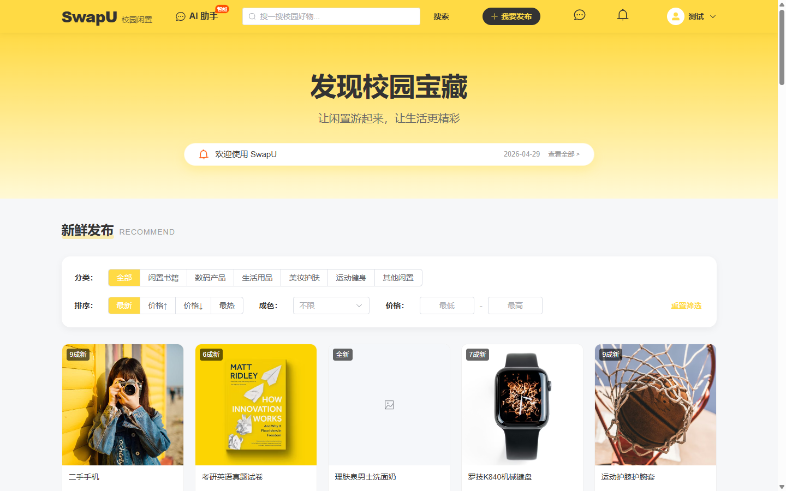
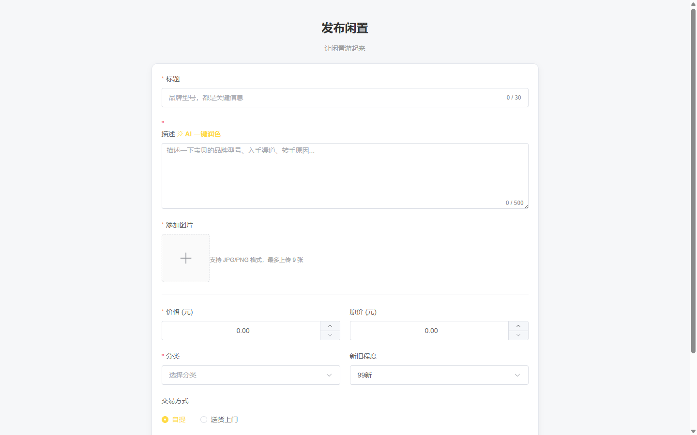
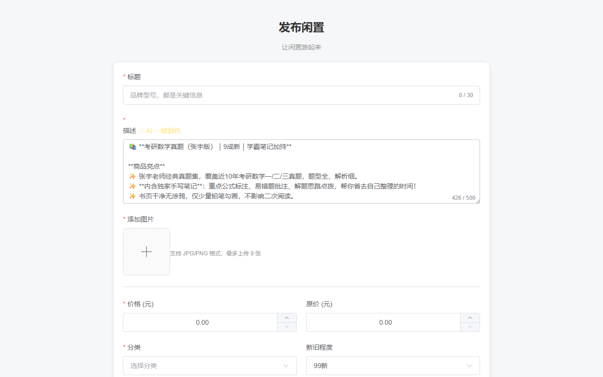
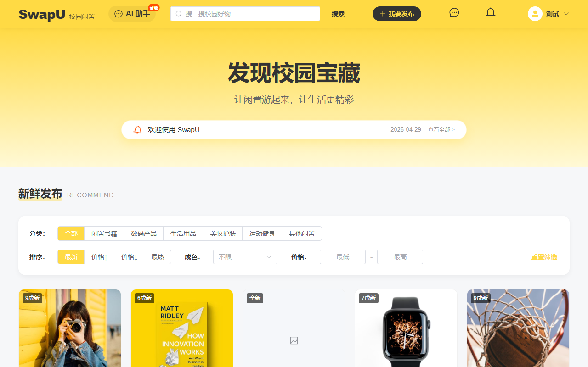
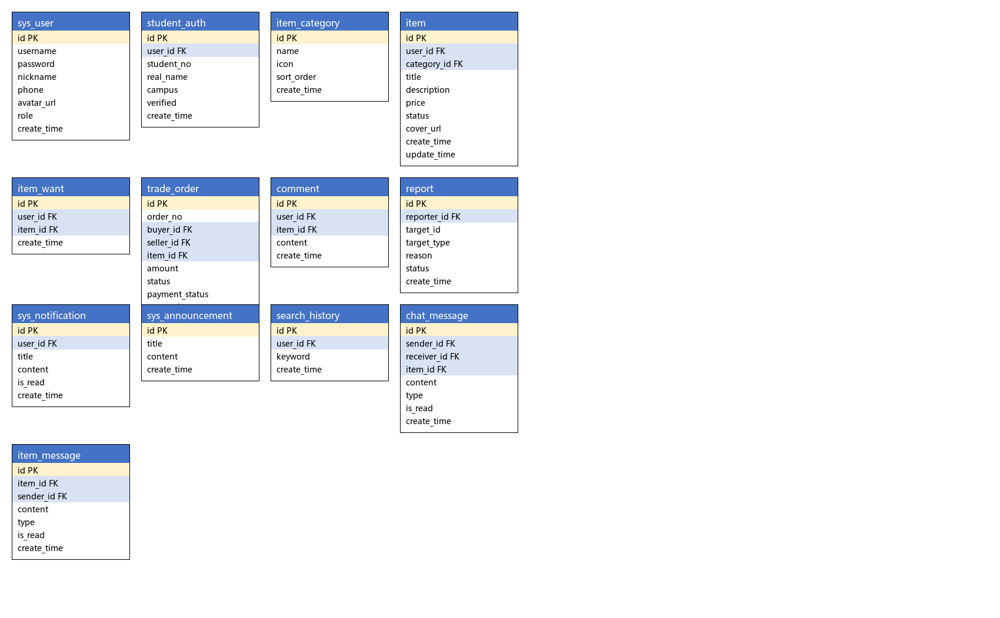

# SwapU 毕业设计答辩准备说明书（最终复习版）

> 适用场景：答辩前的集中复习。
> 目标：把"业务问题 -> 技术设计 -> 代码落地 -> 工程价值"这条链讲清楚。
> 说明：本文档内容已按当前项目代码重新校对，每个技术点都配有"为什么这么设计"的文字说明，适合直接拿来复习和准备答辩讲稿。

---

## 一、先背下这 8 句话

1. `SwapU` 是一个面向校园场景的二手交易平台，解决发布、搜索、交易和信任问题。
2. 首页普通商品列表走 `MySQL`，全文搜索走 `Elasticsearch`，AI 导购走 `PgVector`。
3. AI 不是简单接 API，而是通过 `Prompt 约束 + RAG 检索` 嵌入业务流程。
4. 下单时通过 `Redisson 分布式锁` 防止同一商品被并发超卖。
5. 订单超时取消通过 `RocketMQ 延时消息` 实现，不靠数据库轮询。
6. 支付链路是 `发起支付 -> 支付宝回调 -> 验签 -> 幂等更新订单状态`。
7. Redis 在当前项目中主要用于 `分布式锁` 和 `限流`，不是商品读缓存。
8. 项目亮点不在于技术堆砌，而在于把 `AI、搜索、支付、并发控制、异步消息` 形成了完整闭环。

---

## 二、项目概览

### 2.1 一句话介绍

`SwapU` 是一个基于 `Vue 3 + Spring Boot` 实现的校园二手交易平台，支持商品发布、全文搜索、在线交易、支付宝沙箱支付、即时通讯、后台管理，并在此基础上加入了 `AI 文案润色` 和 `RAG 智能导购` 两类智能能力。

**为什么做这个项目**：现有二手平台（闲鱼、转转）面向全国大市场，缺乏校园场景的本地化适配——校园交易具有地理聚合、即时交付、周期性强（毕业季/开学季）的特点，通用平台无法高效匹配这些需求。此外，传统二手平台的商品检索依赖关键词匹配，无法理解"有没有考研资料，预算50以内"这类自然语言购物意图。

### 2.2 技术栈

| 层次 | 技术 | 选型理由 |
|------|------|---------|
| 前端 | Vue 3、Vite、Pinia、Vue Router、Element Plus | Vue 3 的组件化架构和响应式数据绑定机制为复杂交互页面提供高效支撑；Pinia 比 Vuex 更轻量 |
| 后端 | Spring Boot 3.2、MyBatis-Plus、JWT、AOP | Spring Boot 自动配置降低开发复杂度；MyBatis-Plus 简化单表 CRUD |
| 主数据库 | MySQL 8 | ACID 事务保证订单/支付等核心业务的数据一致性 |
| 搜索 | Elasticsearch | IK 分词 + BoolQuery 实现中文全文检索，支持高亮和前缀补全 |
| 向量检索 | PgVector + Spring AI | 语义相似度检索，支持自然语言到商品的语义匹配 |
| 并发控制 | Redis + Redisson | Redisson 提供分布式锁，防止并发超卖；Redis 还承担限流职责 |
| 消息队列 | RocketMQ | 延时消息实现订单超时自动取消；异步同步商品数据到 ES |
| 支付 | 支付宝沙箱 | 模拟真实支付链路，包含 RSA 验签和异步回调 |
| AI | DeepSeek Chat + Ollama bge-m3 | DeepSeek 用于文案润色和导购对话；bge-m3 用于 Embedding 向量化 |

### 2.3 论文截图（可直接用于答辩展示）

#### 首页与商品浏览


#### 商品发布与 AI 润色



#### AI 导购



#### 订单与支付


#### 后台管理与数据库结构



---

## 三、系统总体架构怎么讲

### 3.1 一句话架构

前端通过 `HTTP + WebSocket` 与后端交互；后端以 `Spring Boot` 为核心，主业务写入 `MySQL`，商品全文检索走 `Elasticsearch`，AI 语义检索走 `PgVector`，高并发控制依靠 `Redis/Redisson`，超时任务依靠 `RocketMQ`，支付依靠 `支付宝沙箱`。

### 3.2 分层结构

```text
前端表现层：Vue 3 + Element Plus + Pinia
    ↓
接口接入层：Controller + Interceptor + AOP
    ↓
业务服务层：Service / ServiceImpl
    ↓
数据与中间件层：MySQL + Redis + ES + PgVector + RocketMQ
    ↓
第三方服务层：DeepSeek / Ollama / 支付宝沙箱
```

**每一层的职责说明**：

- **前端表现层**：Vue 3 Composition API 组织代码，Pinia 管理全局状态，Element Plus 提供 UI 组件。WebSocket 客户端负责即时通讯，Axios 拦截器自动注入 JWT Token。
- **接口接入层**：LoginInterceptor 统一解析 JWT Token 并将用户信息放入请求域；AdminInterceptor 拦截 `/admin/**` 路由做角色校验；AOP 切面实现接口限流（基于 Redis 令牌桶）。
- **业务服务层**：核心业务逻辑所在。TradeOrderServiceImpl 处理订单创建（含分布式锁和编程式事务），ItemServiceImpl 处理商品发布（含 AI 审核和多数据源同步），ChatController 处理 AI 交互（含 RAG 管线）。
- **数据与中间件层**：四个存储引擎各司其职——MySQL 为主数据源保证事务一致性，ES 承担全文检索，PgVector 承担语义检索，Redis 承担分布式锁和限流。RocketMQ 负责延时消息和异步数据同步。
- **第三方服务层**：DeepSeek API 提供大语言模型能力，Ollama 本地部署 bge-m3 提供 Embedding 向量化，支付宝沙箱提供支付模拟。

### 3.3 关键代码入口

- 路由与资源映射：[WebConfig](file:///d:/SwapU/backend/src/main/java/com/swapu/config/WebConfig.java)
- 登录鉴权：[LoginInterceptor](file:///d:/SwapU/backend/src/main/java/com/swapu/interceptor/LoginInterceptor.java)
- 管理员拦截：[AdminInterceptor](file:///d:/SwapU/backend/src/main/java/com/swapu/interceptor/AdminInterceptor.java)
- 商品核心服务：[ItemServiceImpl](file:///d:/SwapU/backend/src/main/java/com/swapu/service/impl/ItemServiceImpl.java)
- 订单核心服务：[TradeOrderServiceImpl](file:///d:/SwapU/backend/src/main/java/com/swapu/service/impl/TradeOrderServiceImpl.java)
- AI 导购：[ChatController](file:///d:/SwapU/backend/src/main/java/com/swapu/controller/ChatController.java)
- 支付链路：[PaymentController](file:///d:/SwapU/backend/src/main/java/com/swapu/controller/PaymentController.java)

### 3.4 为什么这么设计

- `MySQL` 负责事务一致性，适合订单、用户、商品这类核心业务数据。订单创建和商品状态变更必须在同一事务中完成，MySQL 的 ACID 特性保证了这一点。
- `Elasticsearch` 负责全文搜索、高亮、前缀补全，适合"找商品"。MySQL 的 LIKE 查询无法支持中文分词和相关性排序，ES 的 IK 分词器和 BoolQuery 可以精确匹配用户搜索意图。
- `PgVector` 负责语义相似度检索，适合"自然语言问商品"。ES 做的是关键词匹配，无法理解"预算50以内的考研资料"这类语义化查询，PgVector 通过向量余弦相似度实现语义匹配。
- `Redis` 发挥在分布式锁和限流上的优势。分布式锁防止并发超卖，限流防止接口被恶意刷调用。
- `RocketMQ` 负责"订单超时取消""商品异步同步索引"等不适合阻塞主链路的任务。延时消息比定时轮询更精准、更节省资源。

---

## 四、商品数据到底从哪里来

这是答辩最容易被问到，也最容易说错的点。

### 4.1 首页普通商品列表

- 前端首页请求 `/item/list`
- 后端进入 [ItemController](file:///d:/SwapU/backend/src/main/java/com/swapu/controller/ItemController.java#L27-L36)
- 业务逻辑在 [ItemServiceImpl](file:///d:/SwapU/backend/src/main/java/com/swapu/service/impl/ItemServiceImpl.java#L380-L432)
- 底层是 `MyBatis-Plus QueryWrapper` 查 `MySQL`

**必须会说**：

> 首页普通商品流不是 ES 搜索，而是 MySQL 条件查询。  
> 只有用户主动搜索关键词时，系统才会进入 ES 检索链路。

**为什么首页不走 ES**：首页商品列表需要按分类筛选、按时间/价格排序，这些是结构化查询，MySQL 的 QueryWrapper 完全胜任。ES 更适合非结构化的全文检索场景。如果首页也走 ES，会增加不必要的数据同步开销和查询延迟。

### 4.2 全文搜索与搜索建议

- 全文搜索接口 `/item/search`，代码在 [ItemServiceImpl](file:///d:/SwapU/backend/src/main/java/com/swapu/service/impl/ItemServiceImpl.java#L202-L275)
- 搜索建议接口 `/item/suggest`，代码在 [ItemServiceImpl](file:///d:/SwapU/backend/src/main/java/com/swapu/service/impl/ItemServiceImpl.java#L181-L200)

这里使用了：

- `match` 做标题和描述分词搜索
- `wildcard` 支持通配符
- 高亮命中词返回前端
- `matchPhrasePrefix` 实现输入联想

**搜索流程说明**：用户输入关键词后，后端构造 BoolQuery——must 子句包含 match 查询（标题权重2.0 + 描述权重1.0），filter 子句包含分类和价格区间过滤。搜索结果通过 highlight 配置返回高亮片段，前端用红色标注命中词。搜索建议使用 matchPhrasePrefix 实现前缀匹配，用户每输入一个字符就能看到实时补全建议。

### 4.3 AI 导购

- 接口 `/ai/chat`
- 检索不走 MySQL，也不走 ES，而是走 `PgVector`
- 代码分别在 [ChatController](file:///d:/SwapU/backend/src/main/java/com/swapu/controller/ChatController.java#L71-L151) 和 [RagServiceImpl](file:///d:/SwapU/backend/src/main/java/com/swapu/service/impl/RagServiceImpl.java#L49-L90)

**为什么 AI 导购不走 ES**：ES 做的是关键词匹配，用户输入"考研资料"时 ES 能找到标题含"考研"的商品，但用户输入"想买点便宜的学习用品"时 ES 无法匹配。PgVector 通过语义向量相似度检索，可以理解"学习用品"和"考研资料"之间的语义关联。

---

## 五、商品发布链路怎么讲

### 5.1 流程

1. 用户填写标题、描述、价格、分类并提交
2. 后端先做 AI 内容审核
3. 审核通过后写入 MySQL
4. 异步写入 PgVector
5. 发送消息同步到 ES

### 5.2 代码定位

- 发布入口：[ItemController](file:///d:/SwapU/backend/src/main/java/com/swapu/controller/ItemController.java#L19-L25)
- 发布核心逻辑：[ItemServiceImpl](file:///d:/SwapU/backend/src/main/java/com/swapu/service/impl/ItemServiceImpl.java#L76-L157)

### 5.3 这部分为什么是亮点

- AI 被嵌入了真实业务主流程，而不是独立的演示功能
- 商品一次发布后，可以同时被：
  - 普通列表看到（MySQL）
  - ES 搜索到（通过 RocketMQ 异步同步）
  - AI 导购检索到（异步写入 PgVector）

**双轨同步策略说明**：商品数据需要同时存在于 MySQL、ES 和 PgVector 三个存储引擎中。同步策略分为两条轨道——增量同步和全量同步。增量同步通过 RocketMQ 消息实现，商品发布/修改/下架时发送消息，消费者监听后更新 ES 索引；全量同步由管理员在后台手动触发，遍历 MySQL 全量数据重建 ES 和 PgVector 索引，作为兜底修复手段。增量同步保证实时性，全量同步保证最终一致性。

### 5.4 推荐答法

> 用户发布商品后，系统先通过 AI 判断描述是否合规；如果通过，就把商品写入 MySQL，同时异步同步到 ES 和 PgVector。这样同一个商品既能被关键词搜索找到，也能被 AI 导购通过语义方式推荐出来。增量同步保证实时性，全量同步作为兜底修复手段。

---

## 六、AI 文案润色怎么讲

### 6.1 核心位置

- 接口：`POST /ai/polish`
- 代码：[ChatController](file:///d:/SwapU/backend/src/main/java/com/swapu/controller/ChatController.java#L37-L68)

### 6.2 关键思路

不是直接把用户输入丢给模型，而是构造了强约束的 System Prompt，控制：

- 字数不超过 500 字
- 不要客套话
- 输出内容可直接填回表单
- 尽量体现商品亮点、成色和转手原因

### 6.3 System Prompt 原文（答辩时可能被问到）

> 你是一个专业的二手电商平台闲置物品文案写手。请根据用户提供的简单商品信息，帮他生成一段排版精美、生动有吸引力、分段清晰的商品详情描述文案（包含商品亮点、转手原因、新旧程度说明等，如果用户提供的信息较少，你可以根据商品名称进行合理的脑补丰富）。
> 要求：
> 1. 严格控制字数在 500 字以内，文案要精炼。
> 2. 注意：你输出的内容将直接填充到用户的输入框中，因此只需要返回文案本身，绝对不要包含任何客套话、开场白或结尾的提示语。

### 6.4 Prompt 迭代过程（答辩时可能被问到）

System Prompt 经过了十余个版本迭代，以下是关键版本的演进过程：

#### V1：基础版（无约束）

**Prompt**：

> 你是一个二手电商平台的文案写手，请帮用户写一段商品描述。

**用户输入**：考研数学教材，九成新，10块钱

**模型输出**：

> 好的，我来帮你写一段商品描述！
> 
> 这是一本考研数学教材，九成新，价格只要10块钱！非常划算！这本书内容全面，涵盖了考研数学的所有知识点，包括高等数学、线性代数和概率统计。书页保存完好，没有划线和折痕，适合正在备考的同学使用。如果你正在准备考研，这本教材绝对是你的好帮手！快来联系我吧，先到先得哦！如有任何问题欢迎随时咨询～

**问题**：① 包含开场白"好的，我来帮你写一段商品描述！"；② 字数超标（约150字，但复杂商品经常到800+）；③ 结尾有"快来联系我吧""欢迎咨询"等推销话术；④ 缺少商品亮点、转手原因等关键信息。

---

#### V2：加字数约束

**Prompt**：

> 你是一个二手电商平台的文案写手，请帮用户写一段商品描述。字数控制在500字以内。

**模型输出**：

> 没问题！以下是为你生成的商品描述：
> 
> 📚 考研数学教材 | 九成新 | ¥10
> 
> 这本考研数学教材保存状态极佳，九成新无划痕，内容覆盖高数、线代、概率统计三大板块。原价购买要几十块，现在只要10块钱，性价比超高！
> 
> 转手原因：已经成功上岸啦，不再需要了～
> 
> 有兴趣的同学赶紧下手吧！

**问题**：① 仍有开场白"没问题！以下是为你生成的商品描述："；② 仍有结尾推销话术"赶紧下手吧！"；③ 开头加了emoji和标题格式，但用户需要的是纯文案直接填入输入框。

---

#### V3：去掉客套话 + 纯文案输出

**Prompt**：

> 你是一个二手电商平台的文案写手，请帮用户写一段商品描述。字数控制在500字以内。不要包含任何开场白、客套话或结尾提示语，只输出文案本身。

**模型输出**：

> 📚 考研数学教材，九成新，仅需10元！
> 
> 这本教材覆盖高数、线代、概率统计全部考点，内页干净无笔记，适合基础阶段系统复习。原价68元，现仅售10元，性价比极高。
> 
> 转手原因：已成功上岸，教材闲置，低价转给有需要的同学。

**问题**：① 开头仍有emoji和标题行；② 格式不统一——有时分段有时不分段，有时加emoji有时不加；③ 缺少"脑补丰富"的引导，信息少时输出过于简短。

---

#### 最终版：三约束 + 脑补引导

**Prompt**（即当前系统使用的版本）：

> 你是一个专业的二手电商平台闲置物品文案写手。请根据用户提供的简单商品信息，帮他生成一段排版精美、生动有吸引力、分段清晰的商品详情描述文案（包含商品亮点、转手原因、新旧程度说明等，如果用户提供的信息较少，你可以根据商品名称进行合理的脑补丰富）。
> 要求：
> 1. 严格控制字数在 500 字以内，文案要精炼。
> 2. 注意：你输出的内容将直接填充到用户的输入框中，因此只需要返回文案本身，绝对不要包含任何客套话、开场白或结尾的提示语。

**模型输出**：

> 考研数学教材，九成新，低价转让！
> 
> 这本考研数学教材涵盖高等数学、线性代数、概率论与数理统计三大板块，内容全面，知识点覆盖考研大纲全部考点。书籍保存状态良好，内页干净整洁，无划线、无折角、无水渍，几乎全新。
> 
> 亮点：配套习题详解完整，重点章节有荧光笔标注，方便快速回顾核心公式和定理，省去自己整理笔记的时间。
> 
> 转手原因：已成功上岸，教材闲置在家，希望低价转给正在备考的同学，物尽其用。
> 
> 新旧程度：九成新，仅翻阅使用过一学期，书脊无开裂，封面无磨损。

**改进点**：① 无开场白、无结尾话术，纯文案直接可用；② 分段清晰（概述→亮点→转手原因→新旧程度）；③ 信息不足时自动脑补丰富（如"配套习题详解""荧光笔标注"）；④ 字数控制在500字以内。

---

#### 迭代总结

| 版本 | 核心改动 | 解决的问题 | 合格率 |
|------|---------|-----------|--------|
| V1 | 基础指令 | — | ~40% |
| V2 | +字数约束 | 超长输出 | ~55% |
| V3 | +去客套话 | 开场白/推销话术 | ~70% |
| 最终版 | +分段清晰+脑补丰富+直接填入提示 | 格式不统一/信息不足 | ~95% |

**temperature 参数**：设为 0.1 降低随机性，确保相同输入的输出稳定性。测试中发现 temperature=0.7 时同一输入可能生成风格完全不同的文案，而 0.1 时输出高度一致，适合生产环境。

### 6.5 你要会说的话

> 文案润色功能的核心不是模型调用，而是输出约束。我通过 Prompt 限定字数、格式和输出范围，避免模型返回废话，提高其在商品发布场景中的可用性。发布门槛从"撰写详细描述"降低为"输入关键词"。

---

## 七、RAG 智能导购怎么讲

这是全项目最有技术深度的点。

### 7.1 为什么要做 RAG

如果直接把问题发给大模型，大模型可能会：

- 推荐并不存在的商品
- 编造价格和描述
- 给出脱离平台库存的回答

RAG 的目标就是：先检索真实商品，再让模型组织语言。

**防幻觉的两层约束**：第一层是 Prompt 硬性指令——"严禁编造不存在的商品"；第二层是 RAG 事实锚点——每轮对话先检索平台真实在售商品，将检索结果注入上下文，从机制层面限制模型输出范围。即使模型想编造，上下文中只有真实商品信息，输出自然被约束在事实范围内。

### 7.2 三步工作流

#### 第一步：向量入库

- 商品发布后，将"标题 + 描述"拼成文本
- 通过 Embedding 模型（Ollama bge-m3）转成向量
- 存入 PgVector

代码：[RagServiceImpl](file:///d:/SwapU/backend/src/main/java/com/swapu/service/impl/RagServiceImpl.java#L25-L47)

**为什么选 bge-m3**：bge-m3 是多语言 Embedding 模型，对中文支持良好，且可以通过 Ollama 本地部署，避免向量化请求走外网带来的延迟和依赖。

#### 第二步：向量检索

- 用户输入自然语言，例如"有没有考研资料，预算 50 以内"
- 后端将问题向量化
- 在 `PgVector` 中做相似度检索
- 返回 `TopK=3` 商品

代码：[RagServiceImpl](file:///d:/SwapU/backend/src/main/java/com/swapu/service/impl/RagServiceImpl.java#L49-L90)

**为什么选 topK=3**：召回质量和 Prompt 长度的折中。太少会漏召回，太多又会让 Prompt 过长影响模型输出集中度。3 条商品信息注入 Prompt 后总长度可控，模型能针对每条商品给出简短推荐。

#### 第三步：上下文注入 + 模型生成

- 将检索出来的真实商品信息拼进 Prompt
- 再加上历史对话（最近 6 条，即 3 轮）
- 调用 `chatClient.call(prompt)`
- 返回两部分：
  - `text`：AI 文本回复
  - `items`：商品卡片数据

代码：[ChatController](file:///d:/SwapU/backend/src/main/java/com/swapu/controller/ChatController.java#L71-L151)

### 7.3 导购 System Prompt 原文

**基础模板**：

> 你是 SwapU 校园闲置交易平台的智能助手。你可以帮助用户寻找商品、解答交易问题或者进行日常闲聊。
> 如果用户的提问与寻找商品或买卖相关，我已经为你查到了以下几款平台现有的商品，你只需要顺着这些商品简短地做个推荐即可（不要自己编造不存在的商品）。
> 如果用户的提问与商品无关（比如日常问候、闲聊等），请直接友好地回复，不需要强行推荐商品。

**动态追加的商品上下文区块**：

> 【相关商品上下文开始】
> 1. 标题: {title}, 价格: {price}, 描述: {description}
> 2. ...
> 【相关商品上下文结束】
> 请使用友好、热情的语气回答，简明扼要地引导用户查看下面展示的商品卡片。不要在文本里输出长篇大论的商品详情。

**Prompt 拼接逻辑说明**：systemPromptBuilder 首先追加角色定位与行为约束，然后判断检索结果是否为空——不为空时遍历列表将 title、price、description 注入商品上下文区块；为空时指示模型直接友好回复不强行推荐。历史对话截取最近 6 条（3 轮）加入上下文，使模型具备多轮对话能力。整个 Prompt 的拼接逻辑在 ChatController 中完成，RagService 仅负责向量检索，职责划分清晰。

### 7.4 你要会说的 3 句人话

- `RAG 的作用不是让 AI 更聪明，而是让 AI 更可信。`
- `先检索真实商品，再让大模型组织语言，可以减少幻觉。`
- `我的返回不是纯文本，而是 AI 文本 + 商品卡片，方便前端直接渲染。`

---

## 八、订单流程一定要讲清楚

### 8.1 当前真实状态流转

#### 线上交易

1. 买家创建订单
2. 订单 `status=0`
3. 前端显示"待支付"
4. 买家支付成功后进入 `status=1`
5. 买家确认收货后进入 `status=2`
6. 超时未支付或主动取消进入 `status=3`

#### 线下交易

1. 买家创建订单
2. 卖家确认接单后进入 `status=1`
3. 买家确认收货后订单完成

**为什么区分线上/线下**：校园场景中面交很常见，买卖双方确认交易时间地点后直接面交，不需要走支付宝。线下交易由卖家确认接单（而非买家支付）来推进状态，更贴合实际使用场景。

### 8.2 关键代码

- 创建订单：[TradeOrderServiceImpl](file:///d:/SwapU/backend/src/main/java/com/swapu/service/impl/TradeOrderServiceImpl.java#L60-L141)
- 卖家确认：[TradeOrderServiceImpl](file:///d:/SwapU/backend/src/main/java/com/swapu/service/impl/TradeOrderServiceImpl.java#L144-L175)
- 取消订单：[TradeOrderServiceImpl](file:///d:/SwapU/backend/src/main/java/com/swapu/service/impl/TradeOrderServiceImpl.java#L177-L210)
- 确认收货：[TradeOrderServiceImpl](file:///d:/SwapU/backend/src/main/java/com/swapu/service/impl/TradeOrderServiceImpl.java#L213-L250)
- 支付成功：[TradeOrderServiceImpl](file:///d:/SwapU/backend/src/main/java/com/swapu/service/impl/TradeOrderServiceImpl.java#L252-L278)

### 8.3 商品状态联动

- 下单成功后，商品从"在售"变为"交易中"
- 订单取消后，商品回滚为"在售"
- 订单完成后，商品变为"已售出"

这保证了同一商品不会重复成交。

**为什么下单后立即变更商品状态**：这是二手交易场景下的预占资源机制。二手商品通常只有一件，如果不立即变更状态，其他买家可能同时下单同一件商品。商品状态从"在售"变为"交易中"后，后续的下单请求会在校验阶段被拒绝。

### 8.4 订单状态机速记

```
0 待确认/待支付 → 1 进行中 → 2 已完成
       ↘              ↘
        3 已取消       3 已取消
```

---

## 九、防超卖怎么讲

### 9.1 业务背景

二手平台的商品通常只有一件，风险不在"库存减错"，而在"多个请求同时抢同一件商品"。

**为什么不直接用数据库事务保证**：数据库事务只能保证单条 SQL 的原子性，但"查询商品状态 → 创建订单 → 更新商品状态"这三步之间存在时间窗口。如果两个请求同时查询到商品"在售"，都会通过校验并创建订单，导致超卖。分布式锁的作用是串行化这个时间窗口，确保同一商品同一时刻只有一个请求能执行下单逻辑。

### 9.2 解决方案

在创建订单时，使用 `Redisson` 获取以商品 ID 为粒度的分布式锁：

- 锁 Key：`item:lock:{itemId}`
- 采用 `tryLock(3, 10, SECONDS)` 非阻塞式获取
  - 等待 3 秒：最多等 3 秒尝试获取锁
  - 持有 10 秒：锁最多持有 10 秒后自动释放（防死锁）
- 只有抢到锁的线程才能继续落单
- 拿不到锁的线程快速失败，返回"当前下单人数过多，请稍后重试"

### 9.3 代码定位

[TradeOrderServiceImpl](file:///d:/SwapU/backend/src/main/java/com/swapu/service/impl/TradeOrderServiceImpl.java#L61-L69)

### 9.4 为什么锁的是商品不是用户

冲突发生在"同一件商品被同时购买"这个维度，而不是用户维度。
如果锁用户，会错误阻塞"同一个用户买两件不同商品"的正常操作。

### 9.5 锁的释放为什么要检查 isHeldByCurrentThread

锁的释放放在 finally 块中，但必须先通过 `isHeldByCurrentThread()` 判断当前锁是否仍由本线程持有。原因：如果锁已超时自动释放且被其他线程获取，直接执行 unlock 会释放掉其他线程的锁，导致防超卖机制失效。

### 9.6 如何解释 `TransactionTemplate`

当前代码在拿到锁后，通过 `transactionTemplate.execute(...)` 把以下关键操作放入事务：

- 校验商品状态
- 保存订单
- 修改商品状态

这样能保证这几步要么一起成功，要么一起失败。

**为什么不用声明式 @Transactional**：需要在业务校验通过后才开启事务。如果用声明式 @Transactional，事务范围会覆盖校验阶段，导致长事务问题——锁持有时间变长，并发性能下降。编程式事务可以精确控制事务边界，只在真正需要原子性的操作上开启事务。

### 9.7 createOrder 完整执行流程

```
参数校验 → Redisson 分布式锁加锁 → 查询商品并校验状态 → TransactionTemplate.execute() 创建订单并更新商品状态 → 发送 RocketMQ 延时消息 → 释放锁
```

---

## 十、RocketMQ 延时消息怎么讲

### 10.1 业务问题

如果买家创建了线上订单但一直不付款，这个商品就会长期处于"交易中"，影响其他人购买。

### 10.2 解决方案

- 创建线上订单时发送延时消息
- 30 分钟后消费者收到消息
- 如果订单仍未支付，就自动取消并恢复商品状态

### 10.3 关键代码

- 发送延时消息：[TradeOrderServiceImpl](file:///d:/SwapU/backend/src/main/java/com/swapu/service/impl/TradeOrderServiceImpl.java#L113-L125)
- 监听取消：[OrderTimeoutListener](file:///d:/SwapU/backend/src/main/java/com/swapu/listener/OrderTimeoutListener.java)

### 10.4 为什么不用定时任务轮询

- 定时任务会不断扫描数据库，即使没有超时订单也会执行查询
- 延时消息只在指定时间点触发一次，资源利用率更高
- RocketMQ 更适合"某条订单在某个时间点触发一次"的场景
- 定时任务的精度受扫描间隔限制，延时消息可以精确到秒级

### 10.5 幂等性怎么保证

消费者重新查订单状态，只有：

- `status == 0`
- `paymentStatus == 0`

时才执行取消。
已支付订单即使消息到达，也会被安全跳过。

**为什么幂等很重要**：RocketMQ 可能重复投递消息（网络抖动、消费者重启等场景）。如果消费者不做幂等检查，已支付的订单可能被错误取消。

---

## 十一、支付流程怎么讲

### 11.1 完整链路

1. 买家点击支付
2. 后端构造 `AlipayTradePagePayRequest`
3. 浏览器跳转到支付宝沙箱
4. 支付完成后支付宝回调
5. 后端验签并更新订单状态
6. 页面回跳到订单详情

**支付安全三步验证**：① RSA 验签——确认回调确实来自支付宝而非伪造请求；② 幂等检查——paySuccess() 内部先查订单状态，只有 status==0 且 paymentStatus==0 时才更新，避免重复处理；③ 金额校验——回调中的支付金额与订单金额比对，防止金额篡改。

### 11.2 关键代码

- 发起支付：[PaymentController](file:///d:/SwapU/backend/src/main/java/com/swapu/controller/PaymentController.java#L42-L84)
- 同步回调：[PaymentController](file:///d:/SwapU/backend/src/main/java/com/swapu/controller/PaymentController.java#L86-L146)
- 异步回调：[PaymentController](file:///d:/SwapU/backend/src/main/java/com/swapu/controller/PaymentController.java#L148-L203)
- 支付成功处理：[TradeOrderServiceImpl](file:///d:/SwapU/backend/src/main/java/com/swapu/service/impl/TradeOrderServiceImpl.java#L252-L278)

### 11.3 当前代码里你要会解释的一点

当前同步回调 `return` 中也调用了 `paySuccess()`。
这样做是为了在本地或演示环境下，即使异步通知不稳定，也能保证订单状态及时更新；而 `paySuccess()` 内部有幂等校验，所以重复调用是安全的。

**生产环境下的区别**：生产环境以异步回调（notify_url）为准，因为同步回调依赖用户浏览器跳转，用户可能关闭浏览器导致同步回调不到达。当前开发/演示环境中同步回调兜底是为了方便测试。

### 11.4 为什么幂等很重要

支付回调可能：

- 重复通知
- 同步和异步都到达
- 用户重复触发支付动作

如果没有幂等，订单会被重复更新。

---

## 十二、Redis 在项目中到底干了什么

### 12.1 正确答案

当前项目里，Redis **主要不是商品读缓存**，而是：

- 分布式锁（Redisson）
- 接口限流（令牌桶）
- Spring Cache 基础设施

### 12.2 下单限流

代码：[TradeOrderController](file:///d:/SwapU/backend/src/main/java/com/swapu/controller/TradeOrderController.java#L27-L40)

- 每个用户每分钟最多下单 3 次
- 超过就直接拒绝

**为什么需要限流**：防止恶意刷单或脚本攻击。如果不限流，攻击者可以短时间内创建大量订单占住商品，导致正常用户无法购买。

### 12.3 登录限流

代码：[UserController](file:///d:/SwapU/backend/src/main/java/com/swapu/controller/UserController.java#L29-L40)

- 每个 IP 每分钟最多登录 5 次
- 防止暴力破解

### 12.4 为什么不能说"商品详情用了 Redis 缓存"

因为当前商品详情方法上的 `@Cacheable` 已经注释掉。
原因是商品详情每次访问都会增加浏览量，如果走缓存会影响实时更新。

代码：[ItemServiceImpl](file:///d:/SwapU/backend/src/main/java/com/swapu/service/impl/ItemServiceImpl.java#L435-L452)

### 12.5 Redisson 配置在哪

[RedissonConfig](file:///d:/SwapU/backend/src/main/java/com/swapu/config/RedissonConfig.java)

---

## 十三、安全机制怎么讲

### 13.1 JWT 鉴权

- Token 从 `Authorization` 请求头读取（无 Bearer 前缀）
- 登录拦截器统一解析
- 解析成功后把 `userId / username / role` 放入请求域

代码：[LoginInterceptor](file:///d:/SwapU/backend/src/main/java/com/swapu/interceptor/LoginInterceptor.java)

**为什么不用 Bearer 前缀**：项目前端直接将 Token 存入 localStorage，Axios 拦截器取出后放入 Authorization 头，没有添加 Bearer 前缀。后端 LoginInterceptor 直接解析 Token 字符串，简化了前后端交互。

**为什么不用 Session**：前后端分离架构下，后端不维护会话状态，JWT 无状态特性更适合。Token 携带用户身份信息，后端无需查库即可完成鉴权。

### 13.2 管理员越权拦截

- 所有 `/admin/**` 都会进入管理员拦截器
- 角色不是管理员时直接返回 403

代码：[AdminInterceptor](file:///d:/SwapU/backend/src/main/java/com/swapu/interceptor/AdminInterceptor.java)

**拦截器注册顺序**：在 WebMvcConfigurer 中，先注册 LoginInterceptor 拦截所有路径，再注册 AdminInterceptor 只拦截 `/admin/**`。请求先经过登录校验，再经过管理员角色校验，两层拦截保证安全性。

### 13.3 AES 字段级加密

- 手机号字段用 `TypeHandler`
- 入库自动加密
- 查询自动解密
- 业务代码几乎无感知

代码：

- [AesEncryptTypeHandler](file:///d:/SwapU/backend/src/main/java/com/swapu/handler/AesEncryptTypeHandler.java)
- [User](file:///d:/SwapU/backend/src/main/java/com/swapu/entity/User.java#L27-L32)

**零侵入加密的实现原理**：MyBatis 的 TypeHandler 机制在 Java 对象与数据库字段之间自动做类型转换。AesEncryptTypeHandler 在 setNonNullParameter 时加密，在 getNullableResult 时解密。业务代码操作的是明文手机号，完全感知不到加解密过程。这种方式的优点是加密逻辑集中在 TypeHandler 中，不会散落在各个 Service 方法中。

### 13.4 文件上传与访问

- 上传接口：[CommonController](file:///d:/SwapU/backend/src/main/java/com/swapu/controller/CommonController.java)
- 静态映射：[WebConfig](file:///d:/SwapU/backend/src/main/java/com/swapu/config/WebConfig.java#L54-L59)

---

## 十四、PgVector 多数据源配置为什么值得讲

### 14.1 背景

系统主库是 `MySQL`，但向量库是 `PostgreSQL + PgVector`。
如果把第二个数据源处理不好，可能会干扰 MyBatis-Plus 的主数据源。

### 14.2 当前做法

在 [PgVectorConfig](file:///d:/SwapU/backend/src/main/java/com/swapu/config/PgVectorConfig.java) 中：

- 没有把 PostgreSQL DataSource 暴露成常规主数据源 Bean
- 而是手动创建 `JdbcTemplate`
- 再基于它创建 `PgVectorStore`

### 14.3 价值

- 不破坏 MySQL 主数据源
- 避免 MyBatis-Plus 路由错误
- 向量库职责单一，只服务于 RAG

**如果直接注册 PostgreSQL DataSource 会怎样**：Spring Boot 的自动配置会将后注册的 DataSource 也纳入管理，MyBatis-Plus 可能错误地将 SQL 路由到 PostgreSQL，导致业务表查询失败。手动创建 JdbcTemplate 绕过了自动配置，确保 MySQL 仍是唯一的主数据源。

---

## 十五、老师高频追问与标准答法

### Q1：你的项目最大亮点是什么？

最大亮点不是功能多，而是把 AI、搜索、支付、并发控制和异步消息真正整合成了一条完整业务链。比如商品发布后不仅入 MySQL，还会同步到 ES 和向量库；AI 导购不是闲聊，而是基于真实库存做推荐；防超卖不是简单的数据库校验，而是分布式锁 + 编程式事务的配合。

### Q2：为什么不用单一数据库？

MySQL 负责事务一致性，ES 负责全文搜索，PgVector 负责语义检索。单一数据库无法同时兼顾这三类需求。MySQL 的 LIKE 查询无法支持中文分词和相关性排序；ES 无法做向量语义检索；PgVector 不适合做事务型主库。三个存储引擎各司其职，通过双轨同步策略保证数据一致性。

### Q3：为什么不直接让大模型推荐商品？

直接调用大模型会产生幻觉。RAG 的作用是先检索平台真实商品，再把这些商品作为事实输入给模型，约束输出。我的系统还有两层防幻觉机制：Prompt 硬性指令 + RAG 事实锚点，从指令和机制两个层面限制模型编造。

### Q4：Redis 为什么不是做缓存？

当前 Redis 的主要价值体现在分布式锁和限流，而不是商品读取缓存；商品详情还涉及浏览量实时更新，走缓存会导致浏览量不准确。

### Q5：为什么用 RocketMQ，而不是数据库定时扫描？

延时消息更适合订单这种"在指定时间点触发一次"的业务，避免定时轮询带来的数据库压力。定时任务即使没有超时订单也会不断扫描，而延时消息只在指定时间点触发一次，资源利用率更高。

### Q6：防超卖的关键点是什么？

先基于 `itemId` 抢分布式锁，再在事务内检查商品状态和创建订单。只有一个线程能成功把商品从"在售"改成"交易中"。锁的释放放在 finally 块中，并通过 isHeldByCurrentThread() 判断避免释放其他线程持有的锁。

### Q7：订单为什么创建后商品马上变交易中？

因为这是二手交易场景下的预占资源机制；如果不立即变更状态，会出现多人同时下单同一件商品的问题。商品状态从"在售"变为"交易中"后，后续的下单请求会在校验阶段被拒绝。

### Q8：支付流程怎么保证安全？

支付结果不是前端自己改的，而是以后端回调为准；后端必须做 RSA 验签确认回调来自支付宝，做金额校验防止篡改，并在更新订单时做幂等判断防止重复处理。

### Q9：AI 导购为什么选择 `topK=3`？

这是在召回质量和 Prompt 长度之间的折中。太少会漏召回，太多又会让 Prompt 过长，影响模型输出集中度。3 条商品信息注入 Prompt 后总长度可控，模型能针对每条商品给出简短推荐。

### Q10：最容易被误解的点是什么？

"首页商品列表是不是走 ES"和"Redis 是不是做了商品缓存"。实际上首页列表走 MySQL，Redis 主要负责并发控制。

### Q11：你的 System Prompt 是怎么设计的？

润色功能通过三条约束控制输出：字数 500 以内、不含客套话、分段清晰。导购功能通过动态 Prompt 实现：基础模板定义角色和防幻觉指令，检索到商品时追加上下文区块，未检索到时指示模型不强行推荐。两个功能的 temperature 都设为 0.1 保证输出稳定性。

### Q12：双轨同步策略是什么？

增量同步 + 全量同步。增量同步通过 RocketMQ 消息实现，商品发布/修改/下架时发送消息，消费者监听后更新 ES 索引，保证实时性。全量同步由管理员在后台手动触发，遍历 MySQL 全量数据重建 ES 和 PgVector 索引，作为兜底修复手段，保证最终一致性。

---

## 十六、答辩时最容易说错的地方

### 不要说

- "首页所有商品都从 ES 查询"
- "Redis 现在主要缓存商品详情"
- "线上订单要卖家确认后才能支付"
- "AI 导购就是直接调了 DeepSeek 接口"
- "防超卖用了 synchronized"
- "订单超时靠定时任务扫描"

### 要改成

- "首页普通列表走 MySQL，主动搜索才走 ES"
- "Redis 当前主要用于锁和限流"
- "线上订单创建后前端显示待支付，支付成功后才进入进行中"
- "AI 导购基于 RAG 检索真实商品后再调用模型"
- "用 Redisson 分布式锁，因为分布式环境下 synchronized 无效"
- "用 RocketMQ 延时消息，避免数据库轮询压力"

---

## 十七、临场复习策略

### 答辩当天重点看

1. 8 句话（第一节）
2. 6 个必考技术点的"为什么这么设计"
3. System Prompt 原文（可能被问到"你的 Prompt 怎么写的"）
4. createOrder 完整执行流程
5. 订单状态机速记
6. 12 个高频问答

### 答辩陈述节奏建议

1. **开场（30秒）**：项目名称 + 一句话定位 + 两类增强
2. **架构（1分钟）**：分层结构 + 四个存储引擎各司其职
3. **AI 亮点（1.5分钟）**：RAG 三步流程 + 防幻觉两层约束 + Prompt 设计
4. **工程亮点（1.5分钟）**：分布式锁防超卖 + 延时消息 + 支付安全
5. **总结（30秒）**：不是堆技术，而是形成闭环

---

## 十八、你临场必须能流畅说出的 1 分钟总结

> SwapU 是一个面向校园场景的二手交易平台，基础功能包括商品发布、浏览、搜索、下单、支付、聊天和后台管理。在传统电商功能之外，我重点做了两类增强：第一类是 AI 能力，包括商品文案润色和基于 RAG 的智能导购；第二类是工程能力，包括 Redisson 分布式锁防超卖、RocketMQ 延时消息处理超时订单、Elasticsearch 全文检索、AES 字段加密和 JWT 鉴权。整个系统的核心思路不是简单堆技术，而是让 MySQL、ES、PgVector、Redis、RocketMQ 和大模型各自承担最适合的职责，共同支撑校园二手交易这一完整业务闭环。

---

## 十九、复习时最值得反复看的代码

- [ChatController](file:///d:/SwapU/backend/src/main/java/com/swapu/controller/ChatController.java) — AI 润色 + 导购，含 System Prompt 拼接逻辑
- [RagServiceImpl](file:///d:/SwapU/backend/src/main/java/com/swapu/service/impl/RagServiceImpl.java) — 向量入库 + 向量检索
- [ItemServiceImpl](file:///d:/SwapU/backend/src/main/java/com/swapu/service/impl/ItemServiceImpl.java) — 商品发布 + 搜索 + 双轨同步
- [TradeOrderServiceImpl](file:///d:/SwapU/backend/src/main/java/com/swapu/service/impl/TradeOrderServiceImpl.java) — 订单创建（锁+事务）+ 支付成功
- [PaymentController](file:///d:/SwapU/backend/src/main/java/com/swapu/controller/PaymentController.java) — 支付发起 + 同步/异步回调
- [TradeOrderController](file:///d:/SwapU/backend/src/main/java/com/swapu/controller/TradeOrderController.java) — 下单限流
- [UserController](file:///d:/SwapU/backend/src/main/java/com/swapu/controller/UserController.java) — 登录限流
- [LoginInterceptor](file:///d:/SwapU/backend/src/main/java/com/swapu/interceptor/LoginInterceptor.java) — JWT 鉴权
- [AdminInterceptor](file:///d:/SwapU/backend/src/main/java/com/swapu/interceptor/AdminInterceptor.java) — 管理员越权拦截
- [AesEncryptTypeHandler](file:///d:/SwapU/backend/src/main/java/com/swapu/handler/AesEncryptTypeHandler.java) — AES 零侵入加密
- [PgVectorConfig](file:///d:/SwapU/backend/src/main/java/com/swapu/config/PgVectorConfig.java) — 多数据源隔离
- [OrderTimeoutListener](file:///d:/SwapU/backend/src/main/java/com/swapu/listener/OrderTimeoutListener.java) — 延时消息消费
- [RedissonConfig](file:///d:/SwapU/backend/src/main/java/com/swapu/config/RedissonConfig.java) — 分布式锁配置

---

## 二十、最后提醒

- 永远先讲"业务问题"，再讲"技术方案"，最后讲"代码如何落地"。
- 不要背大段源码，要背"我为什么这么设计"。
- 老师真正想听的是：你是不是理解了自己做的系统，而不是是不是会背 API 名称。
- 被问到不会的问题，诚实说"这个点我还没有深入研究"，不要编造。
