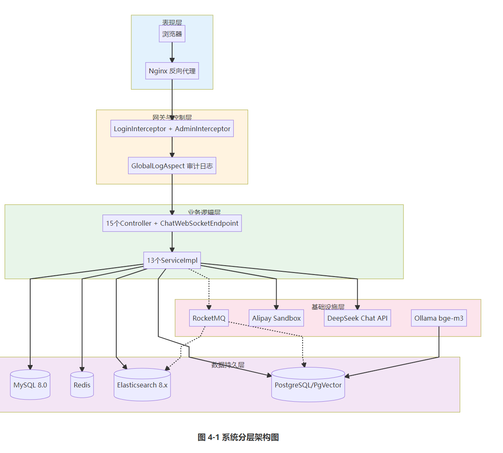
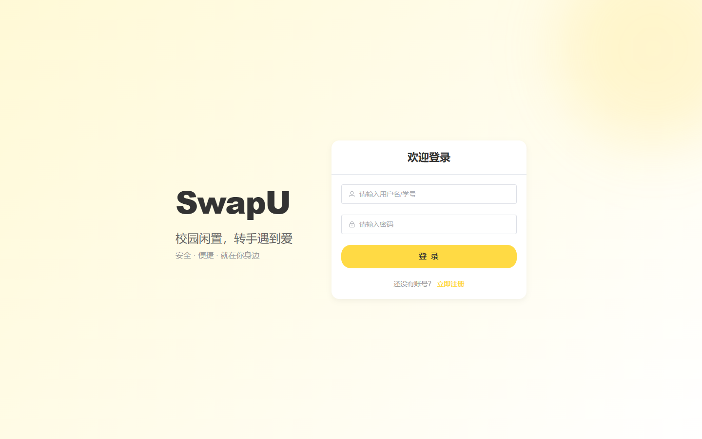
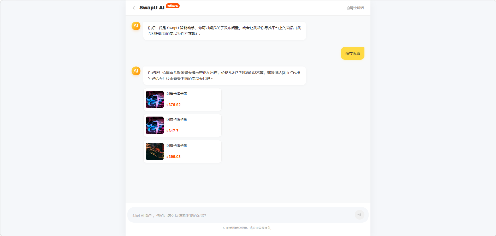
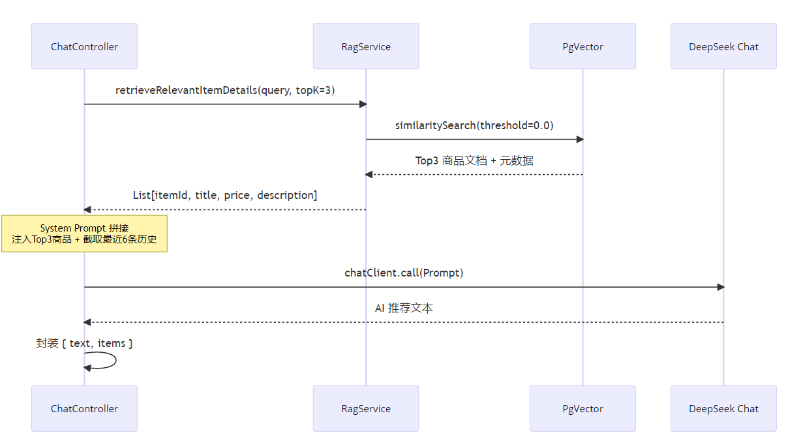
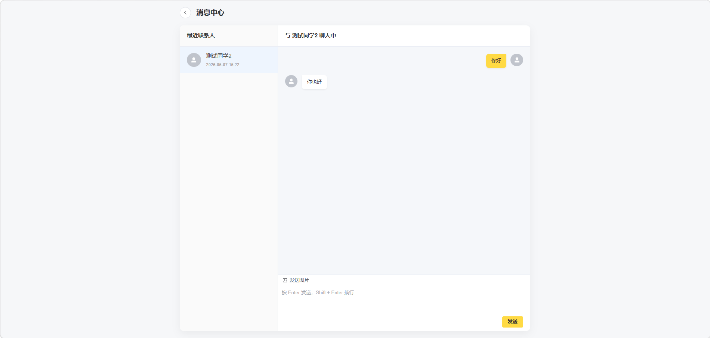
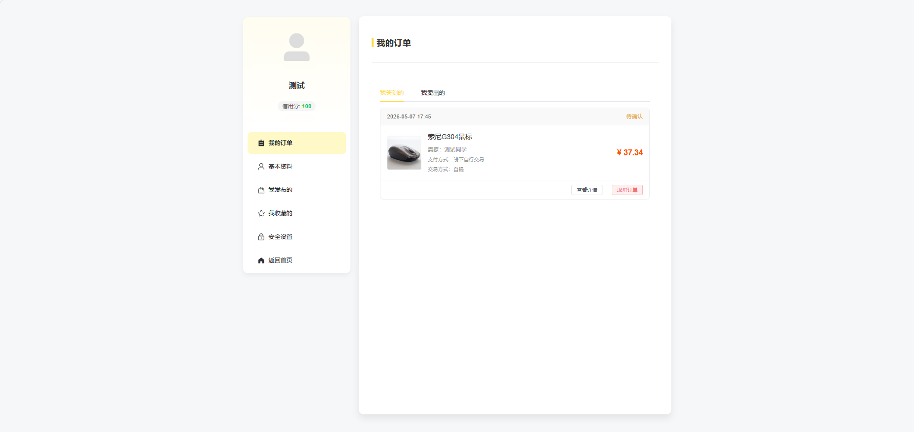
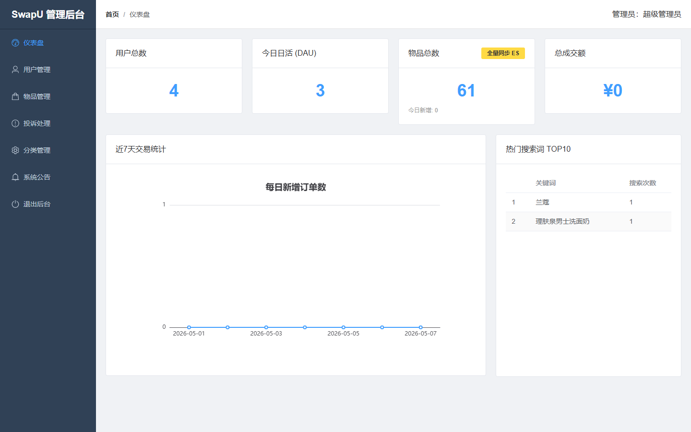
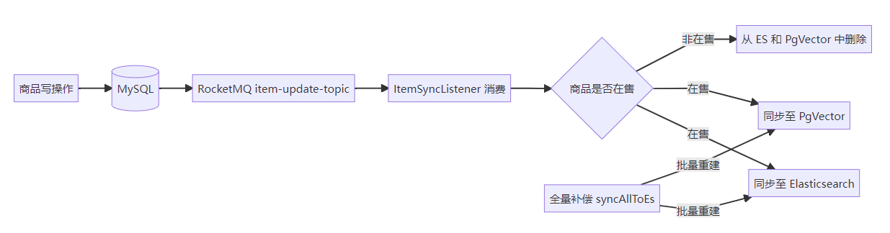
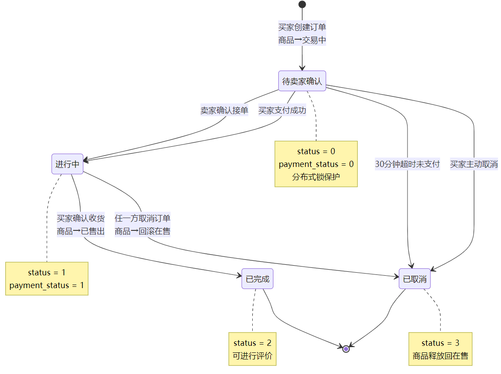
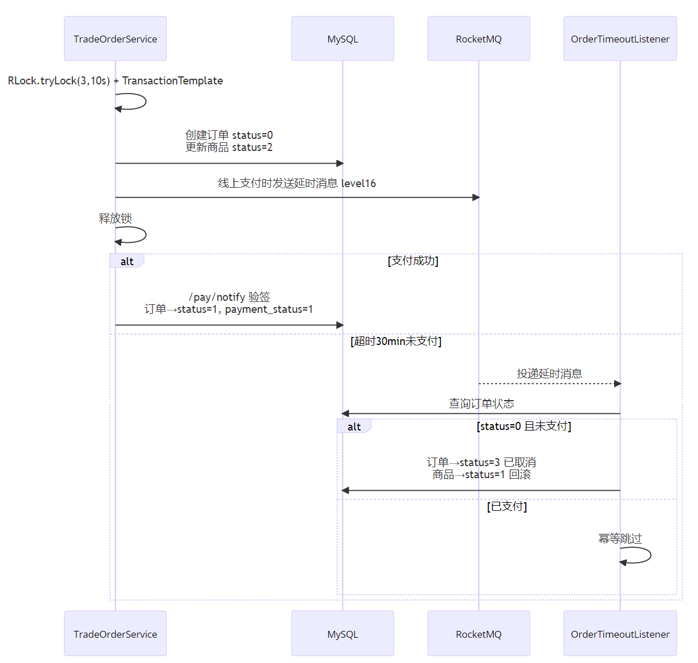

# 基于RAG的校园智能二手交易系统 — 答辩文档

> 答辩人：刘遥杰 | 指导教师：霞 | 计算机与人工智能学院 计科zy2201班

---

## 一、选题背景与意义（约1分钟）

### 讲稿

各位老师好，我答辩的题目是"基于RAG的校园智能二手交易系统设计与实现"。

选题源于一个现实痛点：每学期末，宿舍楼下成摞的考研书、用了几个月的电子设备被淘汰，而新生群体年复一年存在刚性采购需求，二者之间存在**结构性错配**。

闲鱼和转转虽然覆盖了二手交易市场，但它们的架构基因是全国大市场——算法优先推荐跨区域优质卖家，物流围绕快递网络设计。放在校园场景里出现三方面错位：

1. **信息匹配效率不足**：学生关心的是对方在不在相邻宿舍楼，而不是全国信用分
2. **交易摩擦过大**：校园以当面交易为主，但平台缺乏面交支持
3. **发布门槛偏高**：学生不愿为短期闲置品撰写详细描述

SwapU 围绕这三个痛点设计，核心创新在于**将大语言模型深度整合进业务流程**——发布侧通过AI润色降低门槛，导购侧通过RAG管线提升匹配效率。

---

## 二、系统架构（约1.5分钟）

### 讲稿

系统采用前后端分离的B/S架构，分为五层：



- **表现层**：Vue 3 + Element Plus + Pinia，Nginx 反向代理 `/api` 到后端
- **网关控制层**：LoginInterceptor + AdminInterceptor，鉴权与权限拦截
- **业务逻辑层**：15个Controller + 13个ServiceImpl
- **数据持久层**：MySQL（主数据源）+ Redis（缓存）+ ES（全文检索）+ PgVector（向量检索）
- **基础设施层**：RocketMQ + 支付宝沙箱 + Ollama + DeepSeek API

各存储引擎职责隔离：MySQL负责ACID写入，Redis缓存热点商品，ES负责全文检索，PgVector负责向量语义检索。

### 可能被问

**Q: 为什么用四种存储引擎？能不能只用MySQL？**

不能。四种引擎各有不可替代的职责：
- MySQL LIKE 查询无法实现分词和高亮 → 必须用ES
- 向量语义检索MySQL原生不支持 → 必须用PgVector
- 热点商品缓存用Redis可降低MySQL查询压力
- 如果只用MySQL，搜索和AI导购功能无法实现

---

## 三、核心功能展示（约3分钟）

### 3.1 用户认证

登录页面支持普通用户和管理员两种角色，密码BCrypt加密，登录后签发JWT Token。



### 3.2 商品浏览与发布

首页卡片式信息流展示在售商品，支持分类筛选和关键词搜索。


**AI润色**是发布侧的核心功能——卖家输入简要关键词，点击AI润色，后端调用DeepSeek生成结构化商品描述，自动填充至描述框：


### 3.3 AI智能导购（⭐核心创新）

用户以自然语言描述需求，系统基于RAG管线检索真实在售商品并生成推荐：



RAG工作流分三步：



**第一步：向量检索** — 用户查询 → bge-m3 生成1024维向量 → PgVector余弦相似度检索topK=3

**第二步：上下文拼接** — 检索结果注入System Prompt，历史对话截取最近6条

**第三步：推理与封装** — chatClient.call()同步推理，返回AI文本+商品卡片

### 3.4 即时通讯与订单

WebSocket实时私信，支持文本和图片：



订单管理支持买入/卖出双视角：



### 3.5 后台管理

管理员Dashboard通过ECharts展示运营指标：



---

## 四、关键技术实现（约3分钟）

### 4.1 JWT无状态认证

**选型理由**：JWT无状态，水平扩展无需共享Session，适合前后端分离架构。

**完整流程**：
```
用户登录 → JwtUtils.generateToken() 签发Token
→ 前端localStorage存储 → Axios拦截器注入Authorization头
→ LoginInterceptor验证Token → 解析Claims存入Request域
```

**关键代码**：
```java
// JwtUtils.java — HMAC-SHA256签名
private static final SecretKey SECRET_KEY = Keys.hmacShaKeyFor(SECRET_STRING.getBytes(UTF_8));
// Token有效期24小时
private static final long EXPIRATION_TIME = 24 * 60 * 60 * 1000L;
```

```java
// LoginInterceptor.java — 直接取token，不加"Bearer "前缀
String token = request.getHeader("Authorization");
Claims claims = JwtUtils.validateToken(token);
// Integer→Long类型兼容（JVM版本差异）
if (userIdObj instanceof Integer) {
    request.setAttribute("userId", ((Integer) userIdObj).longValue());
}
```

### 4.2 AES字段加密

**方案**：MyBatis-Plus TypeHandler机制，Java对象与数据库之间自动加解密。

```java
// AesEncryptTypeHandler.java
public void setNonNullParameter(PreparedStatement ps, int i, String parameter, JdbcType jdbcType) {
    ps.setString(i, AesEncryptUtils.encrypt(parameter));  // 写入加密
}
public String getNullableResult(ResultSet rs, String columnName) {
    String value = rs.getString(columnName);
    return AesEncryptUtils.decrypt(value);  // 读取解密
}
```

**效果**：数据库中phone字段为Base64密文，API返回时自动解密为明文，业务代码零感知。

### 4.3 RAG双轨同步策略（⭐核心工程问题）

**问题**：PgVector向量数据与MySQL商品行记录如何保持一致？



**第一轨：增量同步**（RocketMQ消息驱动）
```java
// 商品发布时异步写入
CompletableFuture.runAsync(() -> ragService.addDocument(item));
// MQ消息消费
@RocketMQMessageListener(topic = "item-update-topic")
public void onMessage(ItemSyncMessage msg) {
    if (msg.getType() == 1) itemService.doSyncToEs(msg.getItemId());  // 上架
    else if (msg.getType() == 2) itemService.doDeleteFromEs(msg.getItemId());  // 下架
}
```

**第二轨：全量同步**（兜底修复）
```java
// 管理员触发 /admin/es/sync
itemRepository.deleteAll();  // 清除旧数据
for (Item item : items) ragService.addDocument(item);  // 重新写入
itemRepository.saveAll(docs);
```

核心思想：**增量保实时，全量保正确**。

### 4.4 订单状态机与支付



**编程式事务**（而非@Transactional）：
```java
return transactionTemplate.execute(status -> {
    Item item = itemMapper.selectById(order.getItemId());
    if (item.getStatus() != 1) return Result.error("物品当前不可购买");
    save(order);           // 创建订单
    item.setStatus(2);     // 商品→交易中
    itemMapper.updateById(item);
    // 发送延时消息
    mqMsg.setDelayTimeLevel(16);  // 30分钟
    rocketMQTemplate.getProducer().send(mqMsg, 3000);
    return Result.success(order.getOrderId());
});
```

**为什么用TransactionTemplate？** 在业务校验通过后才开启事务，避免事务范围覆盖校验阶段导致长事务。

**支付安全三步验证**：
1. RSA验签 → `AlipaySignature.rsaCheckV1()`
2. 幂等性检查 → 检查paymentStatus
3. 双重回调保障 → 同步return + 异步notify



### 4.5 Elasticsearch搜索

```java
// ItemServiceImpl.search() — NativeQuery构建
Query searchQuery = NativeQuery.builder()
    .withQuery(q -> q.bool(b -> {
        b.must(m -> m.term(t -> t.field("status").value(1)));  // 必须在售
        if (StringUtils.hasText(keyword)) {
            b.must(m -> m.bool(kb -> {
                kb.should(s -> s.match(ma -> ma.field("title").query(keyword)));     // IK分词
                kb.should(s -> s.match(ma -> ma.field("description").query(keyword)));
            }));
        }
    }))
    .withHighlightQuery(new HighlightQuery(...))  // 高亮
    .build();
```

**自动补全**：最初尝试Completion Suggester但mapping冲突，降级为match_phrase_prefix查询。

---

## 五、系统测试（约1分钟）

### 测试环境
4核8GB CentOS 7，JDK 17，MySQL 8.0，Redis 7.0，ES 8.12，PgVector，RocketMQ 5.1

### 功能测试结果

6项核心测试用例全部通过：

| 测试项 | 结果 |
|--------|------|
| 登录与注册 | ✅ 普通用户/管理员登录正常，异常输入有提示 |
| 商品智能发布 | ✅ AI润色输出合格率95%+，发布流程完整 |
| AI导购与检索 | ✅ RAG检索真实商品，推荐可点击跳转 |
| 线上交易订单 | ✅ 下单→支付→确认收货链路完整 |
| 订单超时取消 | ✅ RocketMQ延时消息30分钟自动取消 |
| AES加密与越权防护 | ✅ 数据库密文/API明文，越权返回403 |

### 性能测试结果

| 接口 | 平均响应 | TPS |
|------|---------|-----|
| 首页商品列表(ES) | 45ms | >2100 |
| 商品详情与搜索 | 60ms | ~1800 |
| AI导购接口 | 3.5s | ~15 |

### 安全测试结果

- ✅ AES加密：数据库phone为Base64密文，API返回明文
- ✅ 越权防护：普通用户访问/admin/**返回403，删除他人商品返回"无权操作"

---

## 六、总结与展望（约0.5分钟）

### 主要工作

1. **基础交易链路**：Spring Boot + Vue 3 搭建完整闭环，涵盖发布、搜索、通讯、交易、支付
2. **AI深度整合**：发布侧AI润色降低门槛，导购侧RAG管线提升匹配效率
3. **工程落地**：双轨同步保证向量数据一致性，Prompt迭代调优收敛AI输出行为

### 不足与改进

1. **推理延迟**：当前3.5s同步阻塞 → 后续改流式输出(chatClient.stream())
2. **多模态缺失**：仅文本检索 → 后续引入CLIP实现以图搜图
3. **移动端不足**：仅PC端优化 → 后续响应式布局或微信小程序

---

## 七、高频答辩问题准备

### Q1: 为什么选JWT而不是Session？

JWT无状态，水平扩展无需共享Session存储，天然适应分布式部署。Session/Cookie方案需要额外搭建Redis Session，增加架构复杂度和单点故障风险。

### Q2: RAG如何防止AI编造不存在的商品（幻觉问题）？

两层约束：
1. **Prompt硬性指令**："严禁编造不存在的商品"
2. **RAG事实锚点**（关键）：每轮对话先检索平台真实在售商品，将检索结果注入上下文，从机制层面限制模型输出范围

### Q3: 向量数据和MySQL数据如何保持一致？

双轨同步策略：
- 增量同步：RocketMQ消息驱动，商品变更时实时同步
- 全量同步：管理员手动触发，兜底修复不一致
- 核心思想："增量保实时，全量保正确"

### Q4: 为什么用TransactionTemplate而不是@Transactional？

需要在业务校验通过后才开启事务。@Transactional是AOP代理，方法入口就开启事务，校验阶段也在事务中，导致长事务问题。TransactionTemplate可以精确控制事务范围。

### Q5: similarityThreshold为什么设为0.0？

校园商品库规模有限，阈值过高可能导致用户查询无果。设为0.0允许返回所有计算过相似度的结果，由topK限制数量，再交由大模型判断相关性。

### Q6: 为什么不用Spring Security？

项目权限模型简单（普通用户/管理员两种角色），自定义拦截器更轻量，避免Spring Security的复杂配置。LoginInterceptor验证Token，AdminInterceptor校验role=1。

### Q7: AES加密为什么用TypeHandler而不是手动加密？

TypeHandler是MyBatis的扩展点，对业务代码零侵入。在Entity的phone字段上加`@TableField(typeHandler = AesEncryptTypeHandler.class)`注解即可，所有SQL操作自动走加解密。

### Q8: 自动补全为什么用match_phrase_prefix？

最初尝试Completion Suggester，但要求字段类型为completion，与已有的text类型冲突，重新创建索引影响线上服务。降级为match_phrase_prefix查询title字段，稳定且无需额外映射。

### Q9: 文案润色和导购的区别？

| | 文案润色 /ai/polish | 智能导购 /ai/chat |
|---|---|---|
| RAG检索 | ❌ 不需要 | ✅ 必须 |
| System Prompt | 固定模板 | 动态构建（注入检索结果） |
| 多轮对话 | ❌ 单轮 | ✅ 截取最近6条 |
| temperature | 0.1（低随机性） | 默认 |
| 返回 | 纯文本 | 文本 + 商品卡片 |

### Q10: 系统有什么不足？

1. AI推理延迟3.5s，未采用流式输出
2. 缺少多模态检索（以图搜图）
3. 移动端适配不足
4. 登录接口未配置防护策略

### Q11: Integer转Long的问题是什么？

JWT Claims反序列化时，JSON中小于2³¹的整数默认解析为Integer，大于的解析为Long。JwtUtils和LoginInterceptor中都做了instanceof类型判断兼容处理。

### Q12: Redis在项目中怎么用的？

- 热点商品详情缓存（降低MySQL查询压力）
- 缓存命中率超过95%

### Q13: 前后端怎么交互的？

前端Axios → Vite代理`/api` → Nginx → Spring Boot。请求拦截器注入Token，响应拦截器处理401自动跳转登录。

### Q14: 支付安全怎么保证？

三步验证：
1. RSA验签：`AlipaySignature.rsaCheckV1()`验证回调来自支付宝
2. 幂等性检查：先检查paymentStatus，已支付直接返回
3. 双重回调：同步return + 异步notify，因为本地开发无公网IP

### Q15: 向量写入是同步还是异步？

异步。`CompletableFuture.runAsync(() -> ragService.addDocument(item))`，不阻塞主业务流程。写入失败只记日志不影响商品发布。
